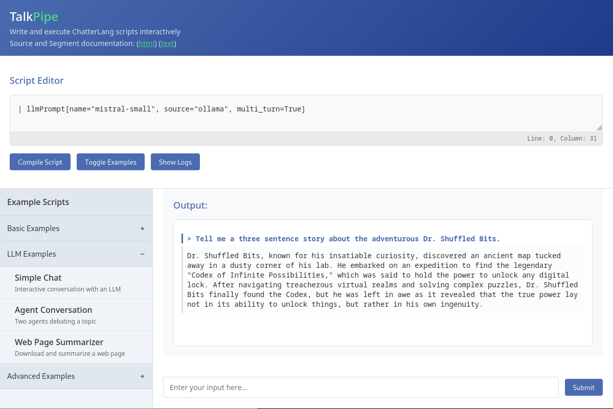
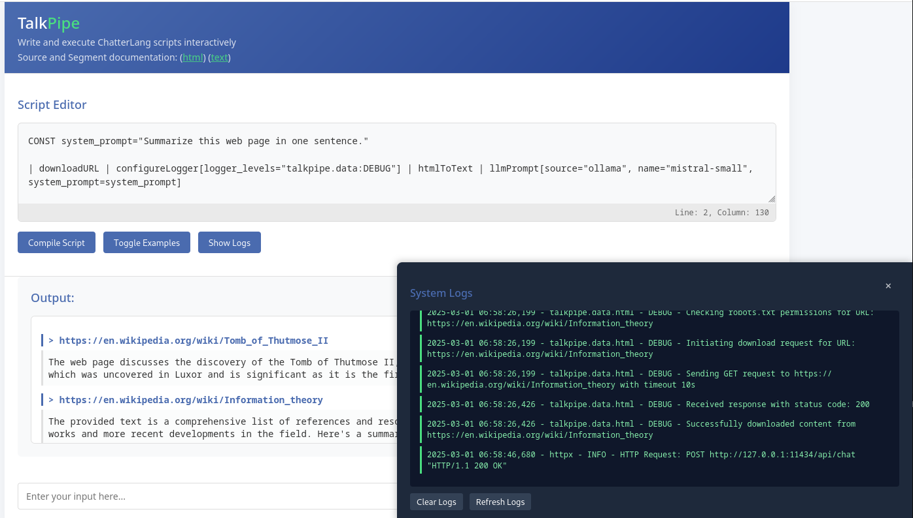

<center></center>

# Introduction

TalkPipe is a Python toolkit designed for developers who want to build smarter, more efficient workflows that integrate Generative AI. Unlike other tools that put LLMs at the center, TalkPipe treats them as one of many tools in your arsenal. With its "Pipe API" and simple scripting language, ChatterLang, TalkPipe makes it easy to create modular reusable components and assemble them into workflows that fit your needs. TalkPipe helps you focus on solving problems, not wrestling with complexity.  

The author of TalkPipe has used the software in a variety of modes, from a continuously running process in a docker container that evaluates research papers, to quick bespoke analytics for exploration in a jupyter notebook, to applications that are run on the command line.

## Current Status
TalkPipe is a feature-rich toolkit already in active use, offering segments for MongoDB, OpenAI-based LLMs, Ollama, web page access, t-SNE, UMAP, and more. While it provides a foundation with a wide array of tools, it is still in its early stages of development. We invite contributors to explore its capabilities, provide feedback, and help shape its evolution.  

## Technical Details

### Versatile and User-Friendly Design
TalkPipe supports diverse use cases, from long-running processes in Python applications to exploratory data analysis in Jupyter Notebooks or deployment in Docker containers. Users can create custom modules by decorating functions with one of three decorators (@source, @segment, and @field_segment), that can then be integrated into other Python code or registered as part of the TalkPipe API. Core classes can also be extended for greater control, but many of TalkPipe's own sources and segments are implemented using these decorators.  This flexibility allows developers to use TalkPipe functionality alongside independent code, build entire applications within the API, or combine both approaches seamlessly.

### Dual-Language Architecture
TalkPipe offers a flexible dual-language approach, containing both an internal and external Domain-Specific Language (DSL):
- **Internal DSL (Pipe API)**: Built with a few straight forward categories of modules and interaction patterns, it includes data sources that inject data and data segments that process it. Fully Pythonic in nature, developers can create new sources and segments by adding decorators to functions, making it simple to integrate with existing applications and repositories.
- **External DSL (ChatterLang)**: Provides a Unix-like pipe syntax that empowers users to construct complex analytic pipelines with ease, enabling a wide range of workflows and data processing tasks.

### LLM Integration
At the core of TalkPipe are LLM segments that currently support OpenAI and Ollama APIs.  The library is designed so that more could be added.  These segments enable functionalities such as simple prompting, guided generation, and vector creation. This allows data to flow through LLMs, with their responses seamlessly included in the output. Additionally, vectors can be accumulated into a matrix, which can then be further processed using segments for algorithms like t-SNE and UMAP.  

### Built-in Applications
- A text command-line interface for interacting with LLMs or creating command-line applications that work with LLMs
- A lightweight web interface for real-time experimentation with ChatterLang
- Components designed for integration into Jupyter notebooks for analytic development

---

## Influences and Differences

- This software incorporates insights learned from [previous work](https://link.springer.com/chapter/10.1007/978-3-319-41956-5_20) in engineering rapidly adaptable analytics in a platform that is designed to evolve over time.  However this current library is engineered to support the integration of generative AI and is not limited to small data.
- The syntax for ChatterLang is reminiscent of the syntax in [Waterslide](https://github.com/waterslideLTS/waterslide).  However, TalkPipe is not engineered or designed primarily for a streaming environment (though it can support that).  It is designed especially
for flexibility and easy of use.  

# Installation directions

```
pip install talkpipe
```

Independently of the installation, you will also need to have the means of accessing the LLMs 
that TalkPipe will use.  If, for example, you plan to use Ollama, you'll need to install Ollama 
on your system.  

# Quick Start - Interactive Chat

Let's say that you want a function that you can provide prompts and get responses for a multi-turn
conversation.  A simple chatterlang script will accomplish that.  These examples assume that you have ollama
installed on your system and have pulled the llama3.2 model.

```python
script = """
| llmPrompt[name="llama3.2", source="ollama", multi_turn=True]  
"""
f = compiler.compile(script)
f = f.asFunction(single_in=True, single_out=True)
ans = f("Good afternoon.  My name is Bob!")
ans = f("What is my name?")
assert "bob" in ans.lower()
 ```

You can also create the same pipeline directly using the associated class.

```python
from talkpipe.llm import chat

f = chat.LLMPrompt(name="llama3.2", source="ollama", multi_turn=True).asFunction(single_in=True, single_out=True)
ans = f("Good afternoon.  My name is Bob!")
ans = f("What is my names?")
assert "bob" in ans.lower()
```

Let's make this a little more interesting, printing out each prompt and accumulating the whole conversation.

```python
script = """
| llmPrompt[name="llama3.2", source="ollama", multi_turn=True, pass_prompts=True] | print | accum[reset=False] 
"""    
f = compiler.compile(script)
f = f.asFunction(single_in=True, single_out=False)
f("Good afternoon.  My name is Bob!")
result = list(f("What is my name?"))
assert len(result) == 4
assert "bob" in result[-1].lower()
```

In this case, you are calling the function multiple times, but it keeps accumulating the results of each run.

Because of the print function, you also see something like the following on stdout:

```
Good afternoon.  My name is Bob!
Good afternoon, Bob! It's nice to meet you. Is there something I can help you with today, or would you like to chat for a bit?
What is my name?
Your name is Bob. We established that earlier when we introduced ourselves. How's your day going so far, Bob?
```

For completeness, let's also build that pipeline using the pipe API

```python
from talkpipe.pipe import io
from talkpipe.llm import chat
from talkpipe.chatterlang import compiler

f = chat.LLMPrompt(name="llama3.2", source="ollama", multi_turn=True, pass_prompts=True) | io.Print() | compiler.Accum(reset=False)
f = f.asFunction(single_in=True, single_out=False)
f("Good afternoon.  My name is Bob!")
result = list(f("What is my name?"))
assert len(result) == 4
assert "bob" in result[-1].lower()
```

The ability to use both the pipe api and chatterlang provide multiple methods to rapidly create and deploy analytics.

# Introduction to TalkPipe and ChatterLang

TalkPipe is a Python package designed to define flexible, reusable components that support exploratory data analysis. 
TalkPipe also provides a pipeline language called ChatterLang, which enables quick creation and composition of analytic workflows.

## ChatterLang

The central concept in ChatterLang is the unit. There are two types of units: sources and segments, analogous to a 
source that feeds a pipe and the segments of pipes through which data flows. 

A source, once initialized, returns a generator, acting as a data provider. A segment, once initialized, takes an 
iterator (typically a generator) as input and returns another generator. Its role is to process each input data item 
and emit zero or more new data items in response. Segments can also perform tasks such as writing data streams to disk.

ChatterLang supports variables. Each variable serves as a buffer for a stream. When used as a segment, it drains 
what it receives into a list and then passes along items one by one. When used as a source, it yields the collected 
items one by one. Variables are prefixed with an @ symbol.

ChatterLang also supports constant declarations, which are particularly useful for defining longer strings, such as 
prompts, that would be cumbersome to include directly in pipeline definitions.

Pipelines in ChatterLang must begin with a source and always include one or more segments. The pipeline's source 
declaration starts with "INPUT FROM", "NEW", or "NEW FROM", all of which are equivalent. These multiple options exist 
for readability and to accommodate user preferences.

Consider the following example, first shown using the Pipe API and then using ChatterLang:

### Example 1 - Hello World

Before discussing the python for using chatterlang, let's use a basic ChatterLang Script.

In this example, "echo" is the source. It takes no input itself. In this case, it has two 
named parameters, "data" and "delimeter." For this particular source, all the data is 
included in the parameters. All units, whether sources or segments, use the same format 
for specifying parameters. The segment "cast" casts every item provided to the specified 
type. If the item can't be converted, it quietly fails and doesn't yield anything. The 
final segment, "print," prints each item it receives to stdout.


```
INPUT FROM echo[data="1|2|hello|3", delimiter="|"] | cast[cast_type="int"] | print
```

In this example, the script
is compiled into a single pipeline.  That pipeline is an iterator that yields data items,
processing them one-by-one.  This is an important concept in TalkPipe.  The script isn't 
"run" at a single time with the results already cached.  Instead, as you draw individual
items off the iterator, that causes a cascading draw of data through the pipe.  This make
processing more efficient (both in terms of memory and time), providing real time results
when needed.

In this case, casting the output of the pipeline call draws all items one-by-one and puts
the results into a list.

**Example 1a**
```python
from talkpipe.chatterlang import compiler

pipeline = compiler.compile('INPUT FROM echo[data="1|2|hello|3", delimiter="|"] | cast[cast_type="int"] | print')
assert list(pipeline()) == [1, 2, 3]
```

In ChatterLang, multiple pipelines can be specified on separate lines. In Example 2, the 
first pipeline stores items in variable 'a', and the second pipeline retrieves and prints 
those values. While functionally equivalent to a single pipeline, this demonstrates using 
multiple pipelines in one script:

**Example 1b**
```
INPUT FROM echo[data="1,2,hello,3"] | cast[cast_type="int"] | @a;
INPUT FROM @a | print
```

In addition to being provided on separate lines (for some applications), pipelines can 
also be separated by a semicolon, as follows:

**Example 1c**
```
INPUT FROM echo[data="1,2,hello,3"] | cast[cast_type="int"] | @a; INPUT FROM @a | print
```

# Use Cases

## Agent Conversation

```
script = """
CONST economist_prompt = "You are an economist debating a proposition.  Reply in one sentence.";
CONST theologian_prompt="You are a reformed theologian debating a proposition. Reply in one sentence.";
INPUT FROM echo[data="The US should give free puppies to all children."] | @next_utterance | accum[variable=@conv] | print;
LOOP 3 TIMES {
    INPUT FROM @next_utterance | llmPrompt[system_prompt=economist_prompt] | @next_utterance | accum[variable=@conv] | print;
    INPUT FROM @next_utterance | llmPrompt[system_prompt=theologian_prompt] | @next_utterance | accum[variable=@conv] | print;
};
INPUT FROM @conv 
"""
```

## Evaluating a Stream of Documents

```python 
    from talkpipe.chatterlang import compiler

    data = [
        """{
        "ts_visited": "2024-12-18T01:00:02.585795", 
        "link": "https://en.wikipedia.org/wiki/Dog", 
        "title": "Dog", 
        "description": "Dogs have been bred for desired behaviors, sensory capabilities, and physical attributes. Dog breeds vary widely in shape, size, and color. They have the same number of bones (with the exception of the tail), powerful jaws that house around 42 teeth, and well-developed senses of smell, hearing, and sight. Compared to humans, dogs have an inferior visual acuity, a superior sense of smell, and a relatively large olfactory cortex. They perform many roles for humans, such as hunting, herding, pulling loads, protection, companionship, therapy, aiding disabled people, and assisting police and the military. "
        }""",

        """{
        "ts_visited": "2024-12-18T01:00:03.585795", 
        "link": "https://en.wikipedia.org/wiki/Husky", 
        "title": "Husky", 
        "description": "Husky is a general term for a dog used in the polar regions, primarily and specifically for work as sled dogs. It refers to a traditional northern type, notable for its cold-weather tolerance and overall hardiness.[1][2] Modern racing huskies that maintain arctic breed traits (also known as Alaskan huskies) represent an ever-changing crossbreed of the fastest dogs."
        }""",

        """{
        "ts_visited": "2024-12-18T01:00:04.585795", 
        "link": "https://en.wikipedia.org/wiki/Cat", 
        "title": "Cat", 
        "description": "The cat (Felis catus), also referred to as the domestic cat, is a small domesticated carnivorous mammal. It is the only domesticated species of the family Felidae. Advances in archaeology and genetics have shown that the domestication of the cat occurred in the Near East around 7500 BC. It is commonly kept as a pet and farm cat, but also ranges freely as a feral cat avoiding human contact. Valued by humans for companionship and its ability to kill vermin, the cat's retractable claws are adapted to killing small prey such as mice and rats. It has a strong, flexible body, quick reflexes, and sharp teeth, and its night vision and sense of smell are well developed. It is a social species, but a solitary hunter and a crepuscular predator. Cat communication includes vocalizations—including meowing, purring, trilling, hissing, growling, and grunting—as well as body language. It can hear sounds too faint or too high in frequency for human ears, such as those made by small mammals. It secretes and perceives pheromones. "
        }"""
    ]

    script = """
    CONST explainPrompt = "Explain whether the content of the title and description fields in the following json is related to canines.";
    CONST scorePrompt = "On a scale of 1 to 10, how related to canines is the combination of the content in the title, description, and explanation fields?";
    | loadsJsonl | llmScore[system_prompt=scorePrompt, name="llama3.1", append_as="canine", temperature=0.0] | appendAs[field_list="canine.score:canine_score"] | toDataFrame 
    """

    pipeline = compiler.compile(script).asFunction(single_in=False, single_out=True)
    df = pipeline(data)
    assert isinstance(df, pd.DataFrame) 
    scores = list(df.canine_score)
    assert all([scores[0] > 7, scores[1] > 7, scores[2] < 3])
```

## Interactive Web Interface

TalkPipe comes with a simple built-in web interface for writing, executing, and testing chatterlang script.  You can start this server using:

`
chatterlang_server [--port xxxx]
`

This will start a server and display the url where the server is running.  Visiting that URL will bring up a web page that looks similar to the following window.  In the top, you can type in your ChatterLang script and then click compile.  If this is a script that requires text to the entered by the user, a new text box will appear at the bottom.  You can then enter the text and press enter.  If it does not require interactive input, it will just run the script.

This first example set up a multi-turn chat bot where you can interactively talk with the LLM.

<center></center>

In this next example, you enter a URL.  TalkPipe will download the URL (assuming it does not violate robots.txt), extract the readable text from the downloaded HTML, and summarize it, this time using an LLM.  In this example, note that the examples have been toggled off and the logs are being displayed.  Both can be toggled on and off by clicking their corresponding buttons.  In this example, we have also configured the logger so that detailed debug information about the downloading is taking place.

<center></center>


# Developer Documentation

## Glossary

* **Segment** - A unit that reads from another Unit and may or may not yield data of its own.  All units that
are not at the start of a pipeline is a Segment.
* **Source** - A unit that takes nothing as input and yields data items.  These Units are used in the
"INPUT FROM..." portion of a pipeline.  
* **Unit** - A component in a pipeline that either produces or processes data.  There are two types of units, Source, and Segments.

## Conventions

### Versioning

This codebase will use [semantic versioning](https://semver.org/) with the addtional convention that during the 0.x.y development that each MINOR version will maintain backward compatibility and PATCH versions will include substantial new capability.  So, for example, every 0.2.x version will be backward compatible, but 0.3.0 might contain code reorganization.

### Codebase Structure

The following are the main breakdown of the codebase.  These should be considered firm but not strict breakdowns.  Sometimes a source could fit within either operations or data, for exmaple.  

* **talkpipe.app** - Contains the primary runnable applications. 
  * Example: runscript
* **talkpipe.operations** - Contains general algorithm implementations.  Associated segments and sources can be included next to the algorithm implementations, but the algorithms themselves should also work stand-alone.
  * Exmaple: bloom filters
* **talkpipe.data** - Contain components having to do with complex, type-specific data manipulation.  
  * Example: extracting text from files.
* **talkpipe.llm** - Contain the abstract classes and implementations for accessing LLMs, both code for accessing specific LLMs and code for doing prompting.
  * Example: Code for talking with Ollama or OpenAI
* **talkpipe.pipe** - Code that implements the core classes and decorators for the pipe api as well and misc implementations of helper segments and sources.
  * Example: echo and the definition of the @segment decorator
* **talkpipe.chatterlang** - The definition, parsers, and compiler for the chatterlang language as well as any chatterlang specific segments and sources
  * Example: the chatterlang compiler and the variable segment

### Source/Segment Names

- **For your own Units, do whatever you want!** These conventions are for authors writing units intended for broader reuse.
- **Classes that implement Units** are named in CamelCase with the initial letter in uppercase.
- **Units defined using `@segment` and `@source` decorators** should be named in camelCase with an initial lowercase letter.
- In **ChatterLang**, sources and segments also use camelCase with an initial lowercase letter.
- Except for the **`cast`** segment, segments that convert data into a specific format—whether they process items one-by-one or drain the entire input—should be named using the form `[tT]oX`, where **X** is the output data type (e.g., `toDataFrame` outputs a pandas DataFrame).
- **Segments that write files** use the form `[Ww]riteX`, where **X** is the file type (e.g., `writeExcel` writes an Excel file, `writePickle` writes a pickle file).
- **Segments that read files** use the form `[Rr]eadX`, where **X** is the file type (e.g., `readExcel` should read an Excel file).
- **Parameter names in segments** should be in all lower case with words separated by an underscore (_)

### Parameter Names

These parameter names should behave consistently across all units:

- **append_as**  
  If used, any processed output is attached to the original data using bracket notation. The original item is then emitted.

- **fail_on_error**
  If True, an operation the exception should be raised, likely aborting the pipeline.  If False, the operation should continue
  and either None should be yielded or nothing, depending on the segment or source.  A warning message should be logged.

- **field**  
  Specifies that the unit should operate on data accessed via “field syntax.” This syntax can include indices, properties, or parameter-free methods, separated by periods.  
  - For example, given `{"X": ["a", "b", ["c", "d"]]}`, the field `"X.2.0"` refers to `"c"`.

- **field_list**
  Specifies that a list of fields can or shoudl be provided, with each field separated
  by a comma.  In some cases, each field needs to be mapped to some other name.  In
  those case, the field and name should be separated by a colon.  In field_lists,
  the underscore (_) refers to the item as a whole.  
  - For example, "X.2.0:SomeName,X.1:SomeOtherName".  If no "name" is provided, 
  the fieldname itself is used.  Where only a list of fields is needed and no names,
  the names can still be provided but have no effect.  

### General Behavior Principles

* Units that have side effects (e.g. writing data to a disk) should generally also pass
on their data.

### Source and Segement Reference

The chatterlang_server command starts a web service designed for experimentation.  It also contains links to HTML and text versions
of all the sources and segments included in TalkPipe.

After talkpipe is installed, a script called "talkpipe_ref" is avaialble that will write an HTML and text file in the current directory, each of which contains the documentation for build-in sources and segments.

### Standard Configuration File Items

 Configuration constants can be defined either in ~/.talkpipe.toml or in environment variables.  Any constant defined in an environment variable needs to be prefixed with TALKPIPE_.  So email_password, stored in an environment variable, needs to be TALKPIPE_email_password.

* **default_embedding_source** - The default source (e.g. ollama) to be used for creating sentence embeddings.
* **default_embedding_model_name** - The name of the LLM model to be used for creating sentence embeddings.
* **default_model_name** - The default name of a LLM model to be used in chat
* **default_model_source** - The default source (e.g. ollama) to be used in chat
* **email_password** - Password for the SMTP server
* **logger_files** - Files to store logs, in the form logger1:fname1,logger2:fname2,...
* **logger_levels** - Logger levles in the form logger1:level1,logger2:level2
* **recipient_email** - Who should receive a sent email
* **rss_url** - The default URL used by the rss segment
* **sender_email** - Who the sender of an email should be
* **smtp_port** - SMTP server port
* **smtp_server** - SMTP server hostname