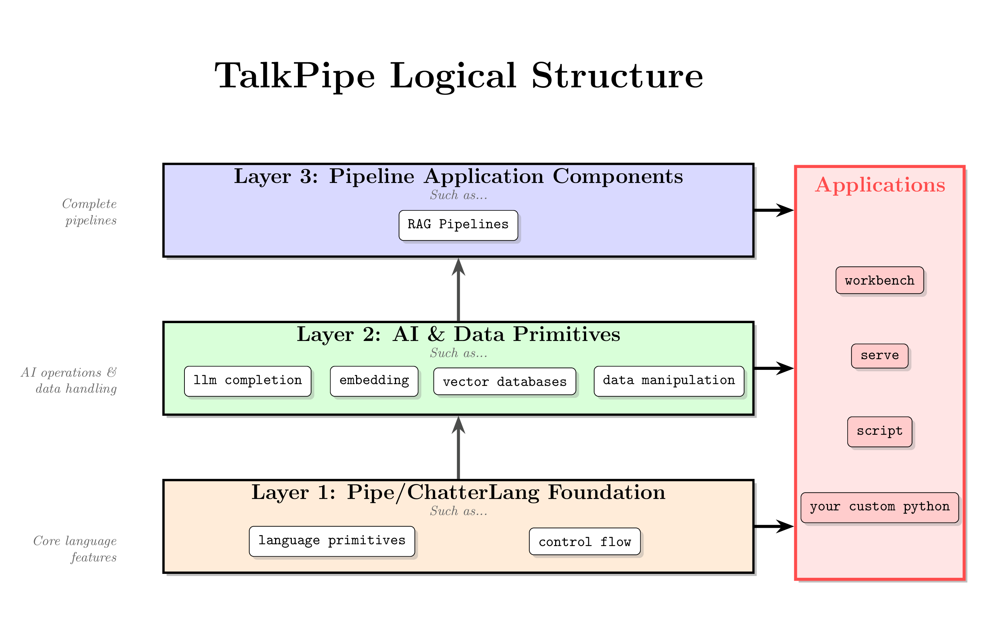

<center></center>

**Build and iterate on AI workflows efficiently.**

TalkPipe is a Python toolkit that makes it easy to create, test, and deploy workflows that integrate Generative AI with your existing tools and data sources. TalkPipe treats LLMs as one tool in your arsenal - letting you build practical solutions that combine AI with data processing, file handling, and more.  

This README introduces TalkPipe at a high level.  See the [complete documentation](docs/README.md) for more detail.

## What Can You Do With TalkPipe?

- **Chat with LLMs** - Create multi-turn conversations with OpenAI, Ollama, or Anthropic models in just 2 lines of code
- **Process Documents** - Extract text from PDFs, analyze research papers, score content relevance
- **Build RAG Pipelines** - Create end-to-end Retrieval-Augmented Generation workflows with vector databases
- **Analyze Web Content** - Download web pages (respecting robots.txt), extract readable text, and summarize
- **Build Data Pipelines** - Chain together data transformations, filtering, and analysis with Unix-like simplicity
- **Create AI Agents** - Build agents that can debate topics, evaluate streams of documents, or monitor RSS feeds
- **Deploy Anywhere** - Run in Jupyter notebooks, as Docker containers, or as standalone Python applications

## Structure

<center></center>

TalkPipe is structured in three layers: ChatterLang Foundation, AI & Data Primitives, and Pipeline Application components.  Applications can draw from any or all of these layers.

The Pipe/ChatterLang Foundation layer offers foundational utilities and abstractions that ensure consistency across the entire system. Pipe serves as TalkPipe's internal domain-specific language (DSL), enabling you to construct sophisticated workflows directly in Python. By instantiating modular classes and chaining them together using the `|` (pipe) operator, you can seamlessly connect sources, segments, and sinks to process data in a clear, readable, and composable manner. The Pipe layer is ideal for users who prefer programmatic control and want to integrate TalkPipe pipelines into larger Python applications or scripts.

ChatterLang is TalkPipe's external domain-specific language (DSL), enabling you to define workflows using concise, human-readable text scripts. These scripts can be compiled directly in Python, producing callable functions that integrate seamlessly with your codebase. ChatterLang also supports specifying workflows via environment variables or command-line arguments, making it easy to configure and automate pipelines in Docker containers, shell scripts, CI/CD pipelines, and other deployment environments. This flexibility empowers both developers and non-developers to create, share, and modify AI-powered workflows without writing Python code, streamlining experimentation and operationalization.


Layer 2, "AI & Data Primitives" is built on Pipe and ChatterLang, provides standardized wrappers for interacting with LLMs, full-text search engines, and vector databases. These components provide a unified interface for core capabilities, making it easy to integrate advanced AI and search features throughout your workflows.

Layer 3, "Pipeline Application Components" assembles components from the lower layers to provide higher level components that can serve as application components. They make simplifying assumptions that provide easy access to complex functionality. For example, the pipelines package includes ready-to-use RAG (Retrieval-Augmented Generation) workflows that combine vector search, prompt construction, and LLM completion in a single component. These are designed both as examples and as ways to rapidly get complex functionality with reasonable assumptions. When those assumptions break, the developer can reach deeper into the other layers and build their own custom solutions.

The Application Components layer contains runnable applications that provide user interfaces and automation tools for working with TalkPipe pipelines and ChatterLang scripts. These components are designed to make it easy to interact with TalkPipe from the command line, web browser, or as part of automated workflows.

### Key Applications

- **[chatterlang_workbench](docs/api-reference/chatterlang-workbench.md)**
  Launches an interactive web interface for writing, testing, and running ChatterLang scripts. It provides real-time execution, logging, and documentation lookup.

- **[chatterlang_script](docs/api-reference/chatterlang-script.md)**
  Runs ChatterLang scripts from files or directly from the command line, enabling batch processing and automation.

- **[chatterlang_serve](docs/api-reference/chatterlang-server.md)**
  Exposes ChatterLang pipelines as REST APIs or web forms, allowing you to deploy workflows as web services or user-facing endpoints.

- **chatterlang_reference_browser**
  An interactive command line application for searching and browsing installed ChatterLang sources and segments.

- **[chatterlang_reference_generator](docs/api-reference/talkpipe-ref.md)**
  Generates comprehensive documentation for all available sources and segments in HTML and text formats.

- **[talkpipe_plugins](docs/api-reference/talkpipe-plugin-manager.md)**
  TalkPipe includes a plugin system that lets developers register their own sources and segments, extending its functionality. This allows the TalkPipe ecosystem to grow through community contributions and domain-specific extensions. talkpipe_plugins lets users view and manage those plugins.

These applications are entry points for different usage scenarios, from interactive development to production deployment.

## Quick Start

Install TalkPipe:
```bash
pip install talkpipe
```

For LLM support, install the provider(s) you need:
```bash
# Install specific providers
pip install talkpipe[openai]    # For OpenAI
pip install talkpipe[ollama]    # For Ollama
pip install talkpipe[anthropic] # For Anthropic Claude

# Or install all LLM providers
pip install talkpipe[all]
```

Create a multi-turn chat function in 2 lines:
```python
from talkpipe.chatterlang import compiler

script = '| llmPrompt[model="llama3.2", source="ollama", multi_turn=True]'
chat = compiler.compile(script).as_function(single_in=True, single_out=True)

response = chat("Hello! My name is Alice.")
response = chat("What's my name?")  # Will remember context
```

# Core Components

## 1. The Pipe API (Internal DSL)

TalkPipe's Pipe API is a Pythonic way to build data pipelines using the `|` operator to chain components:

```python
from talkpipe.pipe import io
from talkpipe.llm import chat

# Create a pipeline that prompts for input, gets an LLM response, and prints it
pipeline = io.Prompt() | chat.LLMPrompt(model="llama3.2") | io.Print()
pipeline = pipeline.as_function()
pipeline()  # Run the interactive pipeline
```

### Creating Custom Components

Add new functionality with simple decorators:

```python
from talkpipe.pipe import core, io

@core.segment()
def uppercase(items):
    """Convert each item to uppercase"""
    for item in items:
        yield item.upper()

# Use it in a pipeline
pipeline = io.echo(data="hello,world") | uppercase() | io.Print()
result = pipeline.as_function(single_out=False)()

# Output:
# HELLO
# WORLD
# Returns: ['HELLO', 'WORLD']
```

## 2. ChatterLang (External DSL)

ChatterLang provides a Unix-like syntax for building pipelines, perfect for rapid prototyping and experimentation:

```
INPUT FROM echo[data="1,2,hello,3"] | cast[cast_type="int"] | print
```

### Registering Custom Components for ChatterLang

To make the `uppercase` segment from section 1 available in ChatterLang, register it with a decorator:

```python
from talkpipe.pipe import core
from talkpipe.chatterlang import registry, compiler

@registry.register_segment("uppercase")
@core.segment()
def uppercase(items):
    """Convert each item to uppercase"""
    for item in items:
        yield item.upper()

# Now use it in ChatterLang scripts
script = 'INPUT FROM echo[data="hello,world"] | uppercase | print'
pipeline = compiler.compile(script).as_function(single_out=False)
result = pipeline()

# Output:
# HELLO
# WORLD
# Returns: ['HELLO', 'WORLD']
```

The `@registry.register_segment()` decorator makes your component discoverable by ChatterLang's compiler, allowing you to use it in scripts alongside built-in segments.

### Key ChatterLang Features

- **Variables**: Store intermediate results with `@variable_name`
- **Constants**: Define reusable values with `CONST name = "value"`
- **Loops**: Repeat operations with `LOOP n TIMES { ... }`
- **Multiple Pipelines**: Chain workflows with `;` or newlines

## 3. Built-in Applications

### Command-Line Tools
- [`chatterlang_workbench`](docs/api-reference/chatterlang-workbench.md) - Start the interactive web interface for experimenting with ChatterLang
- [`chatterlang_script`](docs/api-reference/chatterlang-script.md) - Run ChatterLang scripts from files or command line
- [`chatterlang_reference_generator`](docs/api-reference/talkpipe-ref.md) - Generate documentation for all available sources and segments
- `chatterlang_reference_browser` - Interactive command-line browser for sources and segments
- [`chatterlang_serve`](docs/api-reference/chatterlang-server.md) - Create a customizable user-accessible web interface and REST API from ChatterLang scripts
- [`talkpipe_plugins`](docs/api-reference/talkpipe-plugin-manager.md) - View and manage TalkPipe plugins

### Jupyter Integration
TalkPipe components work seamlessly in Jupyter notebooks for interactive data analysis.

# Detailed Examples

## Example 1: Multi-Agent Debate

Create agents with different perspectives that debate a topic:

```python
from talkpipe.chatterlang import compiler

script = """
CONST economist_prompt = "You are an economist. Reply in one sentence.";
CONST theologian_prompt = "You are a theologian. Reply in one sentence.";

INPUT FROM echo[data="The US should give free puppies to all children."] 
    | @topic 
    | accum[variable=@conversation] 
    | print;

LOOP 3 TIMES {
    INPUT FROM @topic 
        | llmPrompt[system_prompt=economist_prompt] 
        | @topic 
        | accum[variable=@conversation] 
        | print;
    
    INPUT FROM @topic 
        | llmPrompt[system_prompt=theologian_prompt] 
        | @topic 
        | accum[variable=@conversation] 
        | print;
};

INPUT FROM @conversation
"""

pipeline = compiler.compile(script).as_function()
debate = pipeline()  # Watch the debate unfold!
```

## Example 2: Document Stream Evaluation

Score documents based on relevance to a topic:

```python
import pandas as pd
from talkpipe.chatterlang import compiler

# Sample document data
documents = [
    '{"title": "Dog", "description": "Dogs are loyal companions..."}',
    '{"title": "Cat", "description": "Cats are independent pets..."}',
    '{"title": "Wolf", "description": "Wolves are wild canines..."}'
]

script = """
CONST scorePrompt = "Rate 1-10 how related to dogs this is:";

| loadsJsonl 
| llmScore[system_prompt=scorePrompt, model="llama3.2", set_as="dog_relevance"] 
| setAs[field_list="dog_relevance.score:relevance_score"] 
| toDataFrame
"""

pipeline = compiler.compile(script).as_function(single_in=False, single_out=True)
df = pipeline(documents)
# df now contains relevance scores for each document
```

## Example 3: Web Page Analysis

Download and summarize web content:

```python
from talkpipe.chatterlang import compiler

script = """
| downloadURL
| htmlToText
| llmPrompt[
    system_prompt="Summarize this article in 3 bullet points",
    model="llama3.2"
  ]
| print
"""

analyzer = compiler.compile(script).as_function(single_in=True)
analyzer("https://example.com/")
```

## Example 4: Content Evaluation Pipeline

Evaluate and filter articles based on relevance scores:

```python
from talkpipe.chatterlang import compiler

# Sample article data
articles = [
    '{"title": "New LLM Model Released", "summary": "AI Company announces new LLM with improved reasoning"}',
    '{"title": "Smart Home IoT Devices", "summary": "Review of latest Arduino-based home automation"}',
    '{"title": "Cat Videos Go Viral", "summary": "Funny cats take over social media again"}',
    '{"title": "RAG Systems in Production", "summary": "How companies deploy retrieval-augmented generation"}',
]

script = """
# Define evaluation prompts
CONST ai_prompt = "Rate 0-10 how relevant this is to AI practitioners. Consider mentions of AI, ML, algorithms, or applications.";
CONST iot_prompt = "Rate 0-10 how relevant this is to IoT researchers. Consider hardware, sensors, or embedded systems.";

# Process articles
| loadsJsonl
| concat[fields="title,summary", set_as="full_text"]

# Score for AI relevance
| llmScore[system_prompt=ai_prompt, field="full_text", set_as="ai_eval", model="llama3.2"]
| setAs[field_list="ai_eval.score:ai_score,ai_eval.explanation:ai_reason"]

# Score for IoT relevance
| llmScore[system_prompt=iot_prompt, field="full_text", set_as="iot_eval", model="llama3.2"]
| setAs[field_list="iot_eval.score:iot_score,iot_eval.explanation:iot_reason"]

# Find highest score
| lambda[expression="max(item['ai_score'],item['iot_score'])", set_as="max_score"]

# Filter articles with score > 6
| gt[field="max_score", n=6]

# Format output
| toDict[field_list="title,ai_score,iot_score,max_score"]
| print
"""

evaluator = compiler.compile(script).as_function(single_in=False, single_out=False)
results = evaluator(articles)

# Output shows only relevant articles with their scores:
# {'title': 'New LLM Model Released', 'ai_score': 9, 'iot_score': 2, 'max_score': 9}
# {'title': 'Smart Home IoT Devices', 'ai_score': 3, 'iot_score': 9, 'max_score': 9}
# {'title': 'RAG Systems in Production', 'ai_score': 8, 'iot_score': 2, 'max_score': 8}
```

## Example 5: RAG Pipeline with Vector Database

Build a complete RAG (Retrieval-Augmented Generation) system with standalone data:

```python
from talkpipe.chatterlang import compiler

# Sample knowledge base documents
documents = [
    "TalkPipe is a Python toolkit for building AI workflows. It provides a Unix-like pipeline syntax for chaining data transformations and LLM operations.",
    "TalkPipe supports multiple LLM providers including OpenAI, Ollama, and Anthropic. You can switch between providers easily using configuration.",
    "With TalkPipe, you can build RAG systems, multi-agent debates, and document processing pipelines. It uses Python generators for memory-efficient streaming.",
    "TalkPipe offers two APIs: the Pipe API (internal DSL) for Python code and ChatterLang (external DSL) for concise script-based workflows.",
    "Deployment is flexible with TalkPipe - run in Jupyter notebooks, Docker containers, or as standalone applications. The chatterlang_serve tool creates web APIs from scripts."
]

# First, index your documents into a vector database
indexing_script = """
| toDict[field_list="_:text"]
| makeVectorDatabase[
    path="./my_knowledge_base",
    embedding_model="nomic-embed-text",
    embedding_source="ollama",
    embedding_field="text"
  ]
"""
indexer = compiler.compile(indexing_script).as_function(single_in=False)
indexer(documents)

# Now query the knowledge base with RAG
query_script = """
| toDict[field_list="_:text"]
| ragToText[
    path="./my_knowledge_base",
    embedding_model="nomic-embed-text",
    embedding_source="ollama",
    completion_model="llama3.2",
    completion_source="ollama",
    content_field="text",
    prompt_directive="Answer the question based on the background information provided.",
    limit=3
  ]
| print
"""

rag_pipeline = compiler.compile(query_script).as_function(single_in=True)
answer = rag_pipeline("What are the key benefits of using TalkPipe?")
# Returns an LLM-generated answer based on relevant document chunks

# For yes/no questions, use ragToBinaryAnswer:
binary_rag_script = """
| toDict[field_list="_:text"]
| ragToBinaryAnswer[
    path="./my_knowledge_base",
    embedding_model="nomic-embed-text",
    embedding_source="ollama",
    completion_model="llama3.2",
    completion_source="ollama",
    content_field="text"
]
| print
"""
binary_rag = compiler.compile(binary_rag_script).as_function(single_in=True)
result = binary_rag("Does TalkPipe support Docker?")
result = binary_rag("Does TalkPipe have a podcast about pipes?")

# For scored evaluations, use ragToScore:
score_rag_script = """
| toDict[field_list="_:text"]
| ragToScore[
    path="./my_knowledge_base",
    embedding_model="nomic-embed-text",
    embedding_source="ollama",
    completion_model="llama3.2",
    completion_source="ollama",
    prompt_directive="Answer the provided question on a scale of 1 to 5.",
    content_field="text"
  ]
| print
"""
score_rag = compiler.compile(score_rag_script).as_function(single_in=True)
score = score_rag("How flexible is talkpipe?")
score_rag("How well does this text describe pipe smoking?")
```

# Documentation

For comprehensive documentation, and examples, see the **[docs/](docs/)** directory:

- **[📚 Documentation Hub](docs/)** - Complete documentation index and navigation
- **[🚀 Getting Started](docs/quickstart.md)** - Installation, concepts, and first pipeline  
- **[📖 API Reference](docs/api-reference/)** - Complete command and component reference
- **[🏗️ Architecture](docs/architecture/)** - Technical deep-dives and design concepts
- **[💡 Tutorials](docs/tutorials/)** - Real-world usage examples and patterns

## Quick Reference

| Command | Purpose | Documentation |
|---------|---------|---------------|
| `chatterlang_serve` | Create web APIs and forms | [📄](docs/api-reference/chatterlang-server.md) |
| `chatterlang_workbench` | Interactive web interface | [📄](docs/api-reference/chatterlang-workbench.md) |
| `chatterlang_script` | Run scripts from command line | [📄](docs/api-reference/chatterlang-script.md) |
| `chatterlang_reference_generator` | Generate documentation | [📄](docs/api-reference/talkpipe-ref.md) |
| `chatterlang_reference_browser` | Browse sources/segments interactively | - |
| `talkpipe_plugins` | Manage TalkPipe plugins | [📄](docs/api-reference/talkpipe-plugin-manager.md) |

# Architecture & Development

## Design Principles

### Dual-Language Architecture
- **Internal DSL (Pipe API)**: Pure Python for maximum flexibility and IDE support
- **External DSL (ChatterLang)**: Concise syntax for rapid prototyping

### Streaming Architecture
TalkPipe uses Python generators throughout, enabling:
- Memory-efficient processing of large datasets
- Real-time results as data flows through pipelines
- Natural integration with streaming data sources

### Extensibility First
- Simple decorators (`@source`, `@segment`, `@field_segment`) for adding functionality
- Components are just Python functions - easy to test and debug
- Mix TalkPipe with any Python code or library

## Project Structure

```
talkpipe/
├── app/          # Runnable applications (servers, CLIs)
├── chatterlang/  # ChatterLang parser, compiler, and components
├── data/         # Data manipulation and I/O components
├── llm/          # LLM integrations (OpenAI, Ollama, Anthropic)
├── operations/   # Algorithms and data processing
├── pipe/         # Core pipeline infrastructure
├── pipelines/    # High-level pipeline components (RAG, vector DB)
├── search/       # Search engine integrations (Whoosh, LanceDB)
└── util/         # Utility functions and configuration
```

## Configuration

TalkPipe uses a flexible configuration system via `~/.talkpipe.toml` or environment variables:

```toml
# ~/.talkpipe.toml
default_model_name = "llama3.2"
default_model_source = "ollama"
smtp_server = "smtp.gmail.com"
smtp_port = 587
```

Environment variables use the `TALKPIPE_` prefix:
```bash
export TALKPIPE_email_password="your-password"
export TALKPIPE_openai_api_key="sk-..."
```

### Performance Optimization

TalkPipe includes an optional **lazy loading** feature that can dramatically improve startup performance (up to 18x faster) by deferring module imports until needed:

```bash
# Enable lazy loading for faster startup
export TALKPIPE_LAZY_IMPORT=true
```

This is especially useful for CLI tools and scripts that don't use all TalkPipe features. See the [lazy loading documentation](docs/api-reference/lazy-loading.md) for details.

## Development Guidelines

### Naming Conventions
- **Classes**: `CamelCase` (e.g., `LLMPrompt`)
- **Decorated functions**: `camelCase` (e.g., `@segment def extractText`)
- **ChatterLang names**: `camelCase` (e.g., `llmPrompt`, `toDataFrame`)

### Creating Components

**Sources** generate data:
```python
from talkpipe.pipe import core, io

@core.source()
def fibonacci(n=10):
    a, b = 0, 1
    for _ in range(n):
        yield a
        a, b = b, a + b

# Use it in a pipeline
pipeline = fibonacci(n=5) | io.Print()
result = pipeline.as_function(single_out=False)()

# Output:
# 0
# 1
# 1
# 2
# 3
# Returns: [0, 1, 1, 2, 3]
```

**Segments** transform data:
```python
@core.segment()
def multiplyBy(items, factor=2):
    for item in items:
        yield item * factor

# Use it to double the Fibonacci numbers
pipeline = fibonacci(n=5) | multiplyBy(factor=3) | io.Print()
result = pipeline.as_function(single_out=False)()

# Output:
# 0
# 3
# 3
# 6
# 9
# Returns: [0, 3, 3, 6, 9]
```

**Field Segments** provide a convenient way to create 1:1 segments:
```python
from datetime import datetime
from talkpipe.pipe import core, io
from talkpipe.chatterlang import registry

@registry.register_segment("addTimestamp")
@core.field_segment()
def addTimestamp(item):
    # Handle a single item, not an iterable
    # The decorator handles set_as and field parameters automatically
    return datetime.now()

# Use it with dictionaries
data = [{'name': 'Alice'}, {'name': 'Bob'}]
pipeline = addTimestamp(set_as="timestamp") | io.Print()
    
result = pipeline.as_function(single_in=False, single_out=False)(data)

# Output (timestamps will vary):
# {'name': 'Alice', 'timestamp': datetime.datetime(2024, 1, 15, 10, 30, 45, 123456)}
# {'name': 'Bob', 'timestamp': datetime.datetime(2024, 1, 15, 10, 30, 45, 234567)}

# Now it's also available in ChatterLang:
# script = '| addTimestamp[set_as="timestamp"] | print'
```

### Best Practices

1. **Units with side effects should pass data through** - e.g., `writeFile` should yield items after writing
2. **Use descriptive parameter names** with underscores (e.g., `fail_on_error`, `set_as`)
3. **Handle errors gracefully** - use `fail_on_error` parameter pattern
4. **Document with docstrings** - they appear in generated documentation
5. **Test with both APIs** - ensure components work in both Python and ChatterLang

## Roadmap & Contributing

TalkPipe is under active development. Current priorities:

- **Enhanced LLM Support**: Additional providers, expanded guided generation
- **Data Connectors**: More database integrations, API clients, file formats
- **Workflow Features**: Conditional branching, enhanced error handling, retry logic
- **Performance**: Parallel processing optimization, enhanced lazy loading, better caching
- **Developer Tools**: Better debugging, testing utilities, IDE plugins
- **RAG & Search**: Advanced retrieval strategies, hybrid search, multi-modal embeddings

We welcome contributions! Whether it's new components, bug fixes, documentation, or examples, please check our [GitHub repository](https://github.com/sandialabs/talkpipe) for contribution guidelines.

## Status

TalkPipe is currently in active development. While feature-rich and actively used, APIs may evolve. We follow semantic versioning - minor versions maintain compatibility within the same major version, while major version changes may include breaking changes.

## License

TalkPipe is licensed under the Apache License 2.0. See LICENSE file for details.

# Developer Documentation

## Glossary

* **Unit** - A component in a pipeline that either produces or processes data.  There are two types of units, Source, and Segments.
* **Segment** - A unit that reads from another Unit and may or may not yield data of its own.  All units that
are not at the start of a pipeline is a Segment.
* **Source** - A unit that takes nothing as input and yields data items.  These Units are used in the
"INPUT FROM..." portion of a pipeline.  

## Conventions

### Versioning

This codebase will use [semantic versioning](https://semver.org/) with the additional convention that during the 0.x.y development that each MINOR version will mostly maintain backward compatibility and PATCH versions will include substantial new capability.  So, for example, every 0.2.x version will be mostly backward compatible, but 0.3.0 might contain code reorganization.

### Codebase Structure

The following are the main breakdown of the codebase. These should be considered firm but not strict breakdowns. Sometimes a source could fit within either operations or data, for example.  

* **talkpipe.app** - Contains the primary runnable applications. 
  * Example: chatterlang_script
* **talkpipe.operations** - Contains general algorithm implementations.  Associated segments and sources can be included next to the algorithm implementations, but the algorithms themselves should also work stand-alone.
  * Example: bloom filters
* **talkpipe.data** - Contain components having to do with complex, type-specific data manipulation.  
  * Example: extracting text from files.
* **talkpipe.llm** - Contain the abstract classes and implementations for accessing LLMs, both code for accessing specific LLMs and code for doing prompting.
  * Example: Code for talking with Ollama or OpenAI
* **talkpipe.pipe** - Code that implements the core classes and decorators for the pipe api as well and misc implementations of helper segments and sources.
  * Example: echo and the definition of the @segment decorator
* **talkpipe.chatterlang** - The definition, parsers, and compiler for the chatterlang language as well as any chatterlang specific segments and sources
  * Example: the chatterlang compiler and the variable segment

### Source/Segment Names

- **For your own Units, do whatever you want!** These conventions are for authors writing units intended for broader reuse.
- **Classes that implement Units** are named in CamelCase with the initial letter in uppercase.
- **Units defined using `@segment` and `@source` decorators** should be named in camelCase with an initial lowercase letter.
- In **ChatterLang**, sources and segments also use camelCase with an initial lowercase letter.
- Except for the **`cast`** segment, segments that convert data into a specific format—whether they process items one-by-one or drain the entire input—should be named using the form `[tT]oX`, where **X** is the output data type (e.g., `toDataFrame` outputs a pandas DataFrame).
- **Segments that write files** use the form `[Ww]riteX`, where **X** is the file type (e.g., `writeExcel` writes an Excel file, `writePickle` writes a pickle file).
- **Segments that read files** use the form `[Rr]eadX`, where **X** is the file type (e.g., `readExcel` should read an Excel file).
- **Parameter names in segments** should be in all lower case with words separated by an underscore (_)

### Parameter Names

These parameter names should behave consistently across all units:

- **item** should be used in field_segment, referring to the item passed to the function.  It will not
  be a parameter to the segment in ChatterLang.

- **items** are used in segment definitions, referring to the iterable over all the pieces of data in the stream.
  It will not be a parameter used anywhere as a parameter in ChatterLang.

- **set_as**  
  If used, any processed output is attached to the original data using bracket notation. The original item is then emitted.

- **fail_on_error**
  If True, an operation the exception should be raised, likely aborting the pipeline.  If False, the operation should continue
  and either None should be yielded or nothing, depending on the segment or source.  A warning message should be logged.

- **field**  
  Specifies that the unit should operate on data accessed via “field syntax.” This syntax can include indices, properties, or parameter-free methods, separated by periods.  
  - For example, given `{"X": ["a", "b", ["c", "d"]]}`, the field `"X.2.0"` refers to `"c"`.

- **field_list**
  Specifies that a list of fields can or should be provided, with each field separated
  by a comma.  In some cases, each field needs to be mapped to some other name.  In
  those case, the field and name should be separated by a colon.  In field_lists,
  the underscore (_) refers to the item as a whole.  
  - For example, "X.2.0:SomeName,X.1:SomeOtherName".  If no "name" is provided, 
  the fieldname itself is used.  Where only a list of fields is needed and no names,
  the names can still be provided but have no effect.  

### General Behavior Principles

* Units that have side effects (e.g. writing data to a disk) should generally also pass
on their data.

### Source and Segement Reference

The chatterlang_workbench command starts a web service designed for experimentation.  It also contains links to HTML and text versions
of all the sources and segments included in TalkPipe.

After talkpipe is installed, a script called "chatterlang_reference_browser" is available that provides an interactive command-line search and exploration of sources and segments.  The command "chatterlang_reference_generator" will generate single page HTML and text versions of all the source and segment documentation.

### Standard Configuration File Items

 Configuration constants can be defined either in ~/.talkpipe.toml or in environment variables.  Any constant defined in an environment variable needs to be prefixed with TALKPIPE_.  So email_password, stored in an environment variable, needs to be TALKPIPE_email_password.  Note that in Chatterlang, any variable stored in the format
 can be specified as a parameter using $var_name.  This will get dereferenced to 
 the environment varaible TALKPIPE_var_name or var_name in talkpipe.toml.

* **default_embedding_source** - The default source (e.g. ollama) to be used for creating sentence embeddings.
* **default_embedding_model_name** - The name of the LLM model to be used for creating sentence embeddings.
* **default_model_name** - The default name of a LLM model to be used in chat
* **default_model_source** - The default source (e.g. ollama) to be used in chat
* **email_password** - Password for the SMTP server
* **logger_files** - Files to store logs, in the form logger1:fname1,logger2:fname2,...
* **logger_levels** - Logger levels in the form logger1:level1,logger2:level2
* **recipient_email** - Who should receive a sent email
* **rss_url** - The default URL used by the rss segment
* **sender_email** - Who the sender of an email should be
* **smtp_port** - SMTP server port
* **smtp_server** - SMTP server hostname

---
Last Reviewed: 20251128