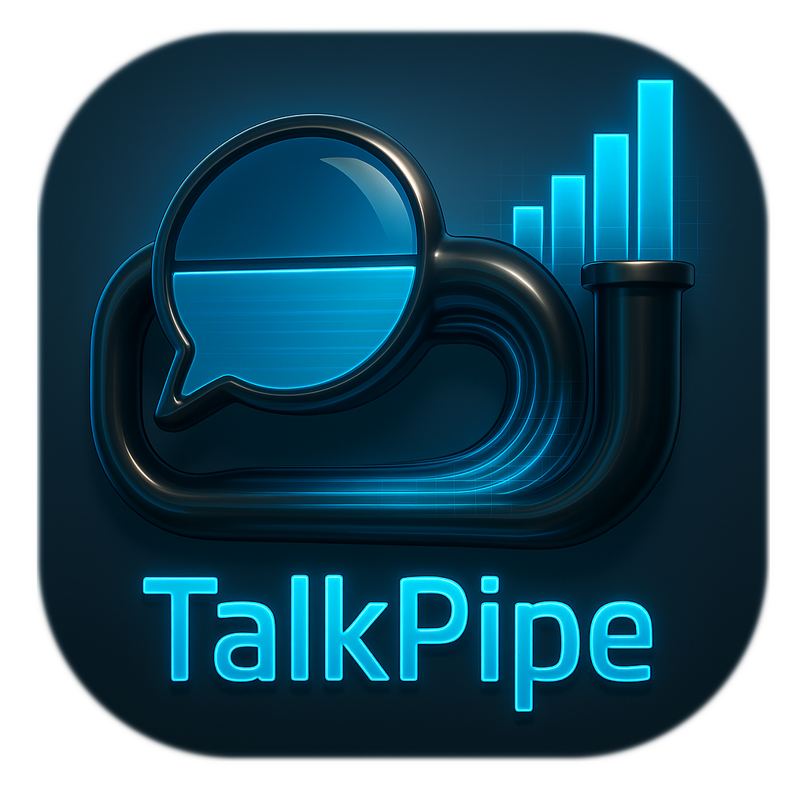
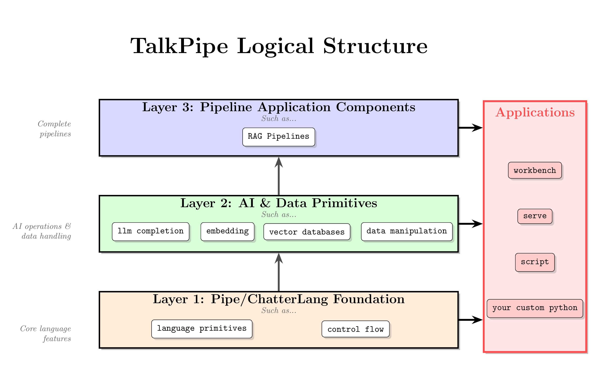

<center></center>

[](https://pypi.org/project/talkpipe/)
[](https://www.python.org/downloads/)
[](LICENSE)

**Build and iterate on AI workflows efficiently.**

TalkPipe is a Python toolkit for creating, testing, and deploying workflows that combine generative AI with your data and tools. Use **Python** (`|` pipelines) or **ChatterLang** (text scripts) with the same building blocks—LLMs as one tool among many.

**Who it is for:** engineers and researchers who want **scriptable AI pipelines**—RAG, batch scoring, web ingestion, agents, and automation—without giving up normal Python when you need it. First-party CLIs and apps (workbench, `chatterlang_serve`) help you go from experiment to batch jobs or a small HTTP surface without a bespoke framework.

**When TalkPipe fits well:** streaming, composable steps; sharing pipelines as text; quick vector-store and RAG flows; mixing LLM calls with pandas, files, and HTTP. **When to look elsewhere:** if you need a large prebuilt agent platform or GUI-first orchestration as your primary model, you may prefer another tool or layer one on top—TalkPipe stays close to code and scripts.

TalkPipe emphasizes **streaming generators** (memory-friendly streams), a **dual API** (Pipe in Python, ChatterLang as a concise DSL), and **built-in tooling** (script runner, reference browser, serve). That complements “everything in Python” stacks by keeping pipeline definitions portable where that helps operations and review.

**Typical vertical flow:** ingest → chunk/embed → index (for example LanceDB) → retrieve → prompt → answer, then expose the same script with `chatterlang_serve` if you want an API. See **[Example 5: RAG pipeline](#example-5-rag-pipeline-with-vector-database)** for a full walkthrough.

This README is a high-level overview. Use the **[documentation map](#documentation)** below or the [documentation hub](docs/README.md) for depth.

## What Can You Do With TalkPipe?

- **Chat with LLMs** - Create multi-turn conversations with OpenAI, Ollama, or Anthropic models in just 2 lines of code
- **Process Documents** - Extract text from PDFs, analyze research papers, score content relevance
- **Build RAG Pipelines** - Create end-to-end Retrieval-Augmented Generation workflows with vector databases
- **Analyze Web Content** - Download web pages (respecting robots.txt), extract readable text, and summarize
- **Build Data Pipelines** - Chain together data transformations, filtering, and analysis with Unix-like simplicity
- **Deploy Anywhere** - Run in Jupyter notebooks, as Docker containers, or as standalone Python applications

## How TalkPipe Is Organized

<center></center>

Three layers; use any mix of them in one project:

- **Pipe and ChatterLang** — Chain **sources**, **segments**, and sinks with `|` in Python, or write **ChatterLang** scripts for the same concepts (easy to drive from env vars and CI).
- **AI and data primitives** — LLMs, full-text search, and vector databases behind one style of component.
- **Pipelines and applications** — Higher-level RAG-style pieces plus CLIs and web apps.

For the full story, see **[Architecture](docs/architecture/)**. Define a pipeline once and run it from Python, Jupyter, Docker, `chatterlang_script`, or `chatterlang_serve`.

### Key Applications

- **[chatterlang_workbench](docs/api-reference/chatterlang-workbench.md)**
  Launches an interactive web interface for writing, testing, and running ChatterLang scripts. It provides real-time execution, logging, and documentation lookup.

- **[chatterlang_script](docs/api-reference/chatterlang-script.md)**
  Runs ChatterLang scripts from files or directly from the command line, enabling batch processing and automation.

- **[chatterlang_serve](docs/api-reference/chatterlang-server.md)**
  Exposes ChatterLang pipelines as REST APIs or web forms, allowing you to deploy workflows as web services or user-facing endpoints.

- **[makevectordatabase & serverag](docs/guides/makevectordatabase-and-serverag.md)**
  Create vector databases from documents and run RAG web servers in two commands—no scripts required.

- **chatterlang_reference_browser**
  An interactive command line application for searching and browsing installed ChatterLang sources and segments.

- **[chatterlang_reference_generator](docs/api-reference/talkpipe-ref.md)**
  Generates comprehensive documentation for all available sources and segments in HTML and text formats.

- **[talkpipe_plugins](docs/api-reference/talkpipe-plugin-manager.md)**
  TalkPipe includes a plugin system that lets developers register their own sources and segments, extending its functionality. This allows the TalkPipe ecosystem to grow through community contributions and domain-specific extensions. talkpipe_plugins lets users view and manage those plugins.

These applications are entry points for different usage scenarios, from interactive development to production deployment.

## Quick Start

**Requirements:** Python 3.11 or newer.

```bash
pip install talkpipe
```

For LLM support, install the provider(s) you need:

```bash
pip install talkpipe[openai]    # OpenAI
pip install talkpipe[ollama]    # Ollama
pip install talkpipe[anthropic] # Anthropic Claude
# Or: pip install talkpipe[all]
```

Configure API keys and provider URLs via environment variables (for example `TALKPIPE_openai_api_key`) or `~/.talkpipe.toml`. If TalkPipe runs on a different machine than your Ollama server, set `TALKPIPE_OLLAMA_SERVER_URL` to that host. See **[Configuration](docs/architecture/configuration.md)** for details and ChatterLang `$var` substitution.

Multi-turn chat in a few lines:

```python
from talkpipe.chatterlang import compiler

script = '| print | llmPrompt[model="llama3.2", source="ollama", multi_turn=True] | print'
chat = compiler.compile(script).as_function(single_in=True, single_out=True)

response = chat("Hello! My name is Alice.")
response = chat("What's my name?")  # Will remember context
```

### RAG at a glance

Index a list of strings, then ask questions against the store (expand with options in [Example 5](#example-5-rag-pipeline-with-vector-database)):

```python
from talkpipe.chatterlang import compiler

docs = ["TalkPipe builds AI pipelines with Python or ChatterLang."]
indexer = compiler.compile(
    '| toDict[field_list="_:text"] | makeVectorDatabase[path="./my_kb", embedding_model="nomic-embed-text", embedding_source="ollama", embedding_field="text", overwrite=True]'
).as_function(single_in=False)
indexer(docs)

rag = compiler.compile(
    '| toDict[field_list="_:text"] | ragToText[path="./my_kb", embedding_model="nomic-embed-text", embedding_source="ollama", completion_model="llama3.2", completion_source="ollama", content_field="text", limit=3] | print'
).as_function(single_in=True)
rag("What is TalkPipe?")
```

# Core Components

## 1. The Pipe API (Internal DSL)

TalkPipe's Pipe API is a Pythonic way to build data pipelines using the `|` operator to chain components:

```python
from talkpipe.pipe import io
from talkpipe.llm import chat

# Create a pipeline that prompts for input, gets an LLM response, and prints it
pipeline = io.Prompt() | chat.LLMPrompt(model="llama3.2") | io.Print()
pipeline = pipeline.as_function()
pipeline()  # Run the interactive pipeline
```

### Creating Custom Components

Add new functionality with simple decorators:

```python
from talkpipe.pipe import core, io

@core.segment()
def uppercase(items):
    """Convert each item to uppercase"""
    for item in items:
        yield item.upper()

# Use it in a pipeline
pipeline = io.echo(data="hello,world") | uppercase() | io.Print()
result = pipeline.as_function(single_out=False)()
print(result)

# Output:
# HELLO
# WORLD
# Returns: ['HELLO', 'WORLD']
```

## 2. ChatterLang (External DSL)

ChatterLang provides a Unix-like syntax for building pipelines, perfect for rapid prototyping and experimentation:

```
INPUT FROM echo[data="1,2,hello,3"] | cast[cast_type="int"] | print
```

### Registering Custom Components for ChatterLang

To make the `uppercase` segment from section 1 available in ChatterLang, register it with a decorator:

```python
from talkpipe.pipe import core
from talkpipe.chatterlang import registry, compiler

@registry.register_segment("uppercase")
@core.segment()
def uppercase(items):
    """Convert each item to uppercase"""
    for item in items:
        yield item.upper()

# Now use it in ChatterLang scripts
script = 'INPUT FROM echo[data="hello,world"] | uppercase | print'
pipeline = compiler.compile(script).as_function(single_out=False)
result = pipeline()

# Output:
# HELLO
# WORLD
# Returns: ['HELLO', 'WORLD']
```

The `@registry.register_segment()` decorator makes your component discoverable by ChatterLang's compiler, allowing you to use it in scripts alongside built-in segments.

### Key ChatterLang Features

- **Variables**: Store intermediate results with `@variable_name`
- **Constants**: Define reusable values with `CONST name = "value"`
- **Loops**: Repeat operations with `LOOP n TIMES { ... }`
- **Multiple Pipelines**: Chain workflows with `;` or newlines

## 3. Built-in Applications

### Command-Line Tools
- [`chatterlang_workbench`](docs/api-reference/chatterlang-workbench.md) - Start the interactive web interface for experimenting with ChatterLang
- [`chatterlang_script`](docs/api-reference/chatterlang-script.md) - Run ChatterLang scripts from files or command line
- [`chatterlang_reference_generator`](docs/api-reference/talkpipe-ref.md) - Generate documentation for all available sources and segments
- `chatterlang_reference_browser` - Interactive command-line browser for sources and segments
- [`chatterlang_serve`](docs/api-reference/chatterlang-server.md) - Create a customizable user-accessible web interface and REST API from ChatterLang scripts
- [`talkpipe_plugins`](docs/api-reference/talkpipe-plugin-manager.md) - View and manage TalkPipe plugins

### Jupyter Integration
TalkPipe components work seamlessly in Jupyter notebooks for interactive data analysis.

# Detailed Examples

## Example 1: Multi-Agent Debate

**Problem:** Run two LLM personas on one seed topic for several rounds. **Result:** Printed turns accumulated in `@conversation`.

```python
from talkpipe.chatterlang import compiler

script = """
CONST economist_prompt = "You are an economist. Reply in one sentence.";
CONST psychologist_prompt = "You are a child psychologist. Reply in one sentence.";

INPUT FROM echo[data="The US should give free puppies to all children."] 
    | @topic 
    | accum[variable=@conversation] 
    | print;

LOOP 3 TIMES {
    INPUT FROM @topic 
        | llmPrompt[system_prompt=economist_prompt, model="llama3.2", source="ollama"] 
        | @topic 
        | accum[variable=@conversation] 
        | print;
    
    INPUT FROM @topic 
        | llmPrompt[system_prompt=psychologist_prompt, model="llama3.2", source="ollama"] 
        | @topic 
        | accum[variable=@conversation] 
        | print;
};

INPUT FROM @conversation
"""

pipeline = compiler.compile(script).as_function()
debate = pipeline()  # Watch the debate unfold!
```

## Example 2: Document Stream Evaluation

**Problem:** Score a stream of JSONL rows with an LLM against a fixed rubric. **Result:** A pandas `DataFrame` with extracted scores per row.

```python
import pandas as pd
from talkpipe.chatterlang import compiler

# Sample document data
documents = [
    '{"title": "Dog", "description": "Dogs are loyal companions..."}',
    '{"title": "Cat", "description": "Cats are independent pets..."}',
    '{"title": "Wolf", "description": "Wolves are wild canines..."}'
]

script = """
CONST scorePrompt = "Rate 1-10 how related to dogs this is:";

| loadsJsonl 
| llmScore[system_prompt=scorePrompt, model="llama3.2", set_as="dog_relevance"] 
| setAs[field_list="dog_relevance.score:relevance_score"] 
| toDataFrame
"""

pipeline = compiler.compile(script).as_function(single_in=False, single_out=True)
df = pipeline(documents)
print(df)
# df now contains relevance scores for each document
```

## Example 3: Web Page Analysis

**Problem:** Fetch a page, strip boilerplate, summarize with an LLM. **Result:** Model output to stdout (here, three bullet points).

```python
from talkpipe.chatterlang import compiler

script = """
| downloadURL
| htmlToText
| llmPrompt[
    system_prompt="Summarize this article in 3 bullet points",
    model="llama3.2"
  ]
| print
"""

analyzer = compiler.compile(script).as_function(single_in=True)
analyzer("http://example.com/")
```

## Example 4: Content Evaluation Pipeline

**Problem:** Score each article on two axes, keep only strong matches. **Result:** Printed dicts for items whose best score exceeds a threshold.

```python
from talkpipe.chatterlang import compiler

# Sample article data
articles = [
    '{"title": "New LLM Model Released", "summary": "AI Company announces new LLM with improved reasoning"}',
    '{"title": "Smart Home IoT Devices", "summary": "Review of latest Arduino-based home automation"}',
    '{"title": "Cat Videos Go Viral", "summary": "Funny cats take over social media again"}',
    '{"title": "RAG Systems in Production", "summary": "How companies deploy retrieval-augmented generation"}',
]

script = """
# Define evaluation prompts
CONST ai_prompt = "Rate 0-10 how relevant this is to AI practitioners. Consider mentions of AI, ML, algorithms, or applications.";
CONST iot_prompt = "Rate 0-10 how relevant this is to IoT researchers. Consider hardware, sensors, or embedded systems.";

# Process articles
| loadsJsonl
| concat[fields="title,summary", set_as="full_text"]

# Score for AI relevance
| llmScore[system_prompt=ai_prompt, field="full_text", set_as="ai_eval", model="llama3.2"]
| setAs[field_list="ai_eval.score:ai_score,ai_eval.explanation:ai_reason"]

# Score for IoT relevance
| llmScore[system_prompt=iot_prompt, field="full_text", set_as="iot_eval", model="llama3.2"]
| setAs[field_list="iot_eval.score:iot_score,iot_eval.explanation:iot_reason"]

# Find highest score
| lambda[expression="max(item['ai_score'],item['iot_score'])", set_as="max_score"]

# Filter articles with score > 6
| gt[field="max_score", n=6]

# Format output
| toDict[field_list="title,ai_score,iot_score,max_score"]
| print
"""

evaluator = compiler.compile(script).as_function(single_in=False, single_out=False)
results = evaluator(articles)

# Output shows only relevant articles with their scores:
# {'title': 'New LLM Model Released', 'ai_score': 9, 'iot_score': 2, 'max_score': 9}
# {'title': 'Smart Home IoT Devices', 'ai_score': 3, 'iot_score': 9, 'max_score': 9}
# {'title': 'RAG Systems in Production', 'ai_score': 8, 'iot_score': 2, 'max_score': 8}
```

## Example 5: RAG Pipeline with Vector Database

**Problem:** Embed texts into a local vector store, then answer questions with retrieval + completion. **Result:** String answers from `ragToText`, plus patterns for yes/no (`ragToBinaryAnswer`) and numeric scores (`ragToScore`).

```python
from talkpipe.chatterlang import compiler

# Sample knowledge base documents
documents = [
    "TalkPipe is a Python toolkit for building AI workflows. It provides a Unix-like pipeline syntax for chaining data transformations and LLM operations.",
    "TalkPipe supports multiple LLM providers including OpenAI, Ollama, and Anthropic. You can switch between providers easily using configuration.",
    "With TalkPipe, you can build RAG systems, multi-agent debates, and document processing pipelines. It uses Python generators for memory-efficient streaming.",
    "TalkPipe offers two APIs: the Pipe API (internal DSL) for Python code and ChatterLang (external DSL) for concise script-based workflows.",
    "Deployment is flexible with TalkPipe - run in Jupyter notebooks, Docker containers, or as standalone applications. The chatterlang_serve tool creates web APIs from scripts."
]

# First, index your documents into a vector database
indexing_script = """
| toDict[field_list="_:text"]
| makeVectorDatabase[
    path="./my_knowledge_base",
    embedding_model="nomic-embed-text",
    embedding_source="ollama",
    embedding_field="text",
    overwrite=True
  ]
"""
indexer = compiler.compile(indexing_script).as_function(single_in=False)
indexer(documents)

# Now query the knowledge base with RAG
query_script = """
| toDict[field_list="_:text"]
| ragToText[
    path="./my_knowledge_base",
    embedding_model="nomic-embed-text",
    embedding_source="ollama",
    completion_model="llama3.2",
    completion_source="ollama",
    content_field="text",
    prompt_directive="Answer the question based on the background information provided.",
    limit=3
  ]
| print
"""

rag_pipeline = compiler.compile(query_script).as_function(single_in=True)
answer = rag_pipeline("What are the key benefits of using TalkPipe?")
# Returns an LLM-generated answer based on relevant document chunks

# For yes/no questions, use ragToBinaryAnswer:
binary_rag_script = """
| toDict[field_list="_:text"]
| ragToBinaryAnswer[
    path="./my_knowledge_base",
    embedding_model="nomic-embed-text",
    embedding_source="ollama",
    completion_model="llama3.2",
    completion_source="ollama",
    content_field="text"
]
| print
"""
binary_rag = compiler.compile(binary_rag_script).as_function(single_in=True)
result = binary_rag("Does TalkPipe support Docker?")
result = binary_rag("Does TalkPipe have a podcast about pipes?")

# For scored evaluations, use ragToScore:
score_rag_script = """
| toDict[field_list="_:text"]
| ragToScore[
    path="./my_knowledge_base",
    embedding_model="nomic-embed-text",
    embedding_source="ollama",
    completion_model="llama3.2",
    completion_source="ollama",
    prompt_directive="Answer the provided question on a scale of 1 to 5.",
    content_field="text"
  ]
| print
"""
score_rag = compiler.compile(score_rag_script).as_function(single_in=True)
score = score_rag("How flexible is talkpipe?")
score_rag("How well does this text describe pipe smoking?")
```

# Documentation

For comprehensive documentation and examples, see the **[docs/](docs/)** directory.

| Goal | Start here |
|------|------------|
| Install and first pipeline | [Getting started](docs/quickstart.md) |
| Commands and components | [API reference](docs/api-reference/) |
| Walkthroughs | [Tutorials](docs/tutorials/) |
| Design and extending TalkPipe | [Architecture](docs/architecture/) |
| Contributor glossary and conventions | [Developer handbook](docs/contributing/developer-handbook.md) |

- **[Documentation hub](docs/)** — Index and navigation
- **[Getting started](docs/quickstart.md)** — Installation, concepts, first pipeline
- **[API reference](docs/api-reference/)** — Commands and components
- **[Architecture](docs/architecture/)** — Technical deep dives
- **[Tutorials](docs/tutorials/)** — Patterns and real-world examples

## Quick Reference

| Command | Purpose | Documentation |
|---------|---------|---------------|
| `chatterlang_serve` | Create web APIs and forms | [📄](docs/api-reference/chatterlang-server.md) |
| `chatterlang_workbench` | Interactive web interface | [📄](docs/api-reference/chatterlang-workbench.md) |
| `chatterlang_script` | Run scripts from command line | [📄](docs/api-reference/chatterlang-script.md) |
| `chatterlang_reference_generator` | Generate documentation | [📄](docs/api-reference/talkpipe-ref.md) |
| `chatterlang_reference_browser` | Browse sources/segments interactively | - |
| `talkpipe_plugins` | Manage TalkPipe plugins | [📄](docs/api-reference/talkpipe-plugin-manager.md) |

# Architecture & Development

## Design Principles

### Dual-Language Architecture
- **Internal DSL (Pipe API)**: Pure Python for maximum flexibility and IDE support
- **External DSL (ChatterLang)**: Concise syntax for rapid prototyping

### Streaming Architecture
TalkPipe uses Python generators throughout, enabling:
- Memory-efficient processing of large datasets
- Real-time results as data flows through pipelines
- Natural integration with streaming data sources

### Extensibility First
- Simple decorators (`@source`, `@segment`, `@field_segment`) for adding functionality
- Components are just Python functions - easy to test and debug
- Mix TalkPipe with any Python code or library

## Project Structure

```
talkpipe/
├── app/          # Runnable applications (servers, CLIs)
├── chatterlang/  # ChatterLang parser, compiler, and components
├── data/         # Data manipulation and I/O components
├── llm/          # LLM integrations (OpenAI, Ollama, Anthropic)
├── operations/   # Algorithms and data processing
├── pipe/         # Core pipeline infrastructure
├── pipelines/    # High-level pipeline components (RAG, vector DB)
├── search/       # Search engine integrations (Whoosh, LanceDB)
└── util/         # Utility functions and configuration
```

## Configuration

TalkPipe uses a flexible configuration system via `~/.talkpipe.toml` or environment variables:

```toml
# ~/.talkpipe.toml
default_model_name = "llama3.2"
default_model_source = "ollama"
smtp_server = "smtp.gmail.com"
smtp_port = 587
```

Environment variables use the `TALKPIPE_` prefix:
```bash
export TALKPIPE_email_password="your-password"
export TALKPIPE_openai_api_key="sk-..."
```

### Performance Optimization

TalkPipe includes an optional **lazy loading** feature that can dramatically improve startup performance (up to 18x faster) by deferring module imports until needed:

```bash
# Enable lazy loading for faster startup
export TALKPIPE_LAZY_IMPORT=true
```

This is especially useful for CLI tools and scripts that don't use all TalkPipe features. See the [lazy loading documentation](docs/api-reference/lazy-loading.md) for details.

## Development Guidelines

### Naming Conventions
- **Classes**: `CamelCase` (e.g., `LLMPrompt`)
- **Decorated functions**: `camelCase` (e.g., `@segment def extractText`)
- **ChatterLang names**: `camelCase` (e.g., `llmPrompt`, `toDataFrame`)

### Creating Components

**Sources** generate data:
```python
from talkpipe.pipe import core, io

@core.source()
def fibonacci(n=10):
    a, b = 0, 1
    for _ in range(n):
        yield a
        a, b = b, a + b

# Use it in a pipeline
pipeline = fibonacci(n=5) | io.Print()
result = pipeline.as_function(single_out=False)()

# Output:
# 0
# 1
# 1
# 2
# 3
# Returns: [0, 1, 1, 2, 3]
```

**Segments** transform data:
```python
from talkpipe.pipe.math import arange
from talkpipe.pipe import core, io

@core.segment()
def multiplyBy(items, factor=2):
    for item in items:
        yield item * factor

# Use it to double the Fibonacci numbers
pipeline = arange(lower=5, upper=10) | multiplyBy(factor=3) | io.Print()
result = pipeline.as_function(single_out=False)()

# Output:
# 0
# 3
# 3
# 6
# 9
# Returns: [0, 3, 3, 6, 9]
```

**Field Segments** provide a convenient way to create 1:1 segments:
```python
from datetime import datetime
from talkpipe.pipe import core, io
from talkpipe.chatterlang import registry

@registry.register_segment("addTimestamp")
@core.field_segment()
def addTimestamp(item):
    # Handle a single item, not an iterable
    # The decorator handles set_as and field parameters automatically
    return datetime.now()

# Use it with dictionaries
data = [{'name': 'Alice'}, {'name': 'Bob'}]
pipeline = addTimestamp(set_as="timestamp") | io.Print()
    
result = pipeline.as_function(single_in=False, single_out=False)(data)

# Output (timestamps will vary):
# {'name': 'Alice', 'timestamp': datetime.datetime(2024, 1, 15, 10, 30, 45, 123456)}
# {'name': 'Bob', 'timestamp': datetime.datetime(2024, 1, 15, 10, 30, 45, 234567)}

# Now it's also available in ChatterLang:
# script = '| addTimestamp[set_as="timestamp"] | print'
```

### Best Practices

1. **Units with side effects should pass data through** - e.g., `writeFile` should yield items after writing
2. **Use descriptive parameter names** with underscores (e.g., `fail_on_error`, `set_as`)
3. **Handle errors gracefully** - use `fail_on_error` parameter pattern
4. **Document with docstrings** - they appear in generated documentation
5. **Test with both APIs** - ensure components work in both Python and ChatterLang

## Roadmap & Contributing

TalkPipe is under active development. Current priorities:

- **Enhanced LLM Support**: Additional providers, expanded guided generation
- **Data Connectors**: More database integrations, API clients, file formats
- **Workflow Features**: Conditional branching, enhanced error handling, retry logic
- **Performance**: Parallel processing optimization, enhanced lazy loading, better caching
- **Developer Tools**: Better debugging, testing utilities, IDE plugins
- **RAG & Search**: Advanced retrieval strategies, hybrid search, multi-modal embeddings

We welcome contributions! Whether it's new components, bug fixes, documentation, or examples, please check our [GitHub repository](https://github.com/sandialabs/talkpipe) for contribution guidelines.

## Status

TalkPipe is in active development: feature-rich and in use, but APIs may evolve. We follow [semantic versioning](https://semver.org/): minor versions aim for compatibility within a major series; major bumps may include breaking changes. **Reasonably stable for everyday use:** install from PyPI, the `|` pipeline model, `compiler.compile(...).as_function(...)`, and optional extras for LLM providers.

## License

TalkPipe is licensed under the Apache License 2.0. See LICENSE file for details.

## Developer handbook

Contributor-focused **glossary, naming conventions, parameter semantics, standard config keys, and segment/source reference notes** live in **[docs/contributing/developer-handbook.md](docs/contributing/developer-handbook.md)**.

---
Last reviewed: 2026-03-20