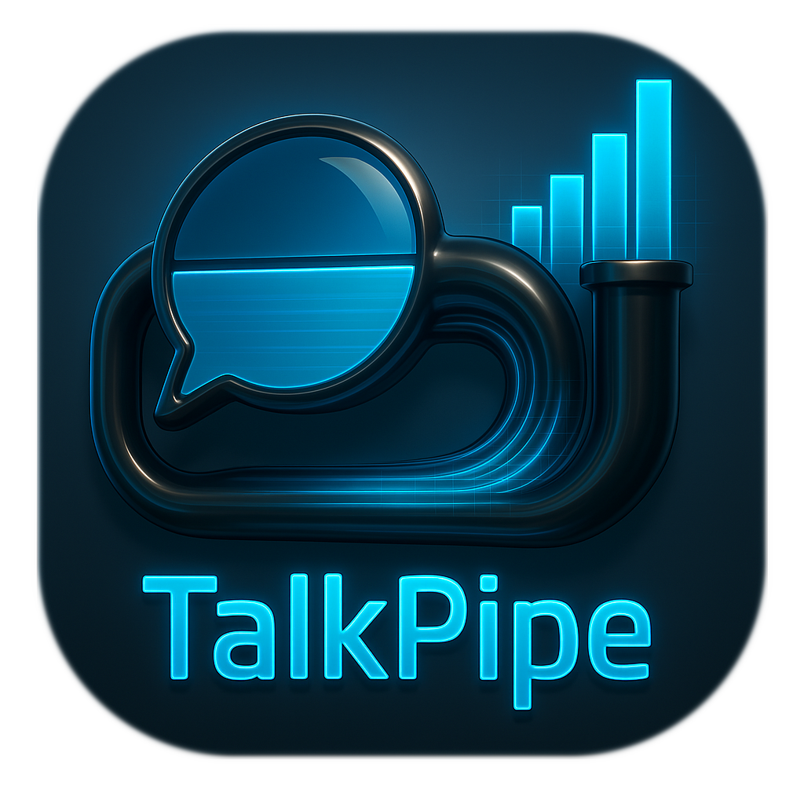
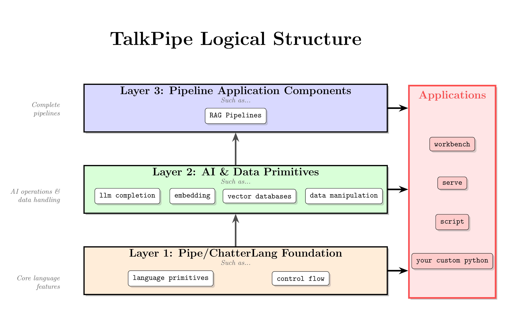

<center></center>

[](https://pypi.org/project/talkpipe/)
[](https://www.python.org/downloads/)
[](LICENSE)
[](https://github.com/sandialabs/talkpipe/actions/workflows/ci-cd.yml)
[](https://codecov.io/gh/sandialabs/talkpipe)

**Build and iterate on AI workflows efficiently.**

TalkPipe is a Python toolkit for creating, testing, and deploying workflows that combine generative AI with your data and tools. Write pipelines in **Python** (the Pipe API, chaining steps with `|`) or in **ChatterLang** (a concise text DSL) — both use the same building blocks, with LLMs as one tool among many. Pipelines are **streaming generators**, so large datasets flow through without being loaded into memory, and a pipeline defined once can run from Python, Jupyter, Docker, `chatterlang_script`, or `chatterlang_serve`.

**Who it's for:** engineers and researchers who want scriptable AI pipelines — RAG, batch scoring, web ingestion, agents, and automation — without giving up normal Python when they need it. If your primary model is a large prebuilt agent platform or GUI-first orchestration, another tool may fit better (or layer one on top); TalkPipe stays close to code and scripts.

**Typical vertical flow:** ingest → chunk/embed → index (for example LanceDB) → retrieve → prompt → answer, then expose the same script with `chatterlang_serve` if you want an API. See **[Example 5: RAG pipeline](#example-5-rag-pipeline-with-vector-database)** for a full walkthrough.

This README is a high-level overview. Use the **[documentation map](#documentation)** below or the [documentation hub](docs/README.md) for depth.

## What Can You Do With TalkPipe?

- **Chat with LLMs** - Create multi-turn conversations with OpenAI, Ollama, or Anthropic models in just a few lines of code
- **Process Documents** - Extract text from PDFs, analyze research papers, score content relevance
- **Build RAG Pipelines** - Create end-to-end Retrieval-Augmented Generation workflows with vector databases
- **Analyze Web Content** - Download web pages (respecting robots.txt), extract readable text, and summarize
- **Build Data Pipelines** - Chain together data transformations, filtering, and analysis with Unix-like simplicity
- **Deploy Anywhere** - Run in Jupyter notebooks, as Docker containers, or as standalone Python applications

## How TalkPipe Is Organized

<center></center>

Three layers; use any mix of them in one project:

- **Pipe and ChatterLang** — Chain **sources**, **segments**, and sinks with `|` in Python, or write **ChatterLang** scripts for the same concepts (easy to drive from env vars and CI).
- **AI and data primitives** — LLMs, full-text search, and vector databases behind one style of component.
- **Pipelines and applications** — Higher-level RAG-style pieces plus CLIs and web apps.

For the full story, see **[Architecture](docs/architecture/)**.

### Key Applications

These are the entry points for different usage scenarios, from interactive development to production deployment:

- **[chatterlang_workbench](docs/api-reference/chatterlang-workbench.md)**
  A browser-based IDE for writing, testing, and running ChatterLang scripts: editor with autocomplete and live error checking, real-time execution, pipeline save/load, next-component suggestions, logging, and documentation lookup.

<video width="640" height="360" controls>
  <source src="docs/workbench_demo.mp4" type="video/mp4">
  Your browser does not support the video tag.
</video>

  ([workbench demo video](docs/workbench_demo.mp4) — direct link, for renderers that strip the embed above.)

- **[chatterlang_script](docs/api-reference/chatterlang-script.md)**
  Runs ChatterLang scripts from files or directly from the command line, for batch processing and automation.

- **[chatterlang_serve](docs/api-reference/chatterlang-server.md)**
  Exposes ChatterLang pipelines as REST APIs or web forms, so workflows can be deployed as web services or user-facing endpoints.

- **[makevectordatabase & serverag](docs/guides/makevectordatabase-and-serverag.md)**
  Create vector databases from documents and run RAG web servers in two commands—no scripts required.

- **[chatterlang_reference_browser & chatterlang_reference_generator](docs/api-reference/talkpipe-ref.md)**
  Browse installed ChatterLang sources and segments interactively, or generate reference documentation for all of them in HTML and text formats.

- **[talkpipe_plugins](docs/api-reference/talkpipe-plugin-manager.md)**
  View and manage plugins. TalkPipe's plugin system lets developers register their own sources and segments, so the ecosystem can grow through community contributions and domain-specific extensions.

- **[Container images](docs/guides/container-images.md)**
  Pull release images from GitHub Container Registry (multi-platform on each GitHub release).

- **[TalkPipe App Center](appcenter/README.md)**
  The part of TalkPipe that installs applications: an app-store-like terminal screen that installs, upgrades, launches, and uninstalls them with [uv](https://docs.astral.sh/uv/), each into its own environment, with desktop launchers. It is designed to make the TalkPipe-based applications (the vault, the writing assistant, the workbench) easy to install and ships with a catalog of them, but it is just as easy to use for any pip-installable Python application that has a command of its own, listed in a catalog of your own. One file, nothing to install first but uv:

  ```bash
  uv run https://github.com/sandialabs/talkpipe/releases/latest/download/talkpipe_appcenter.py
  ```

  Each release attaches the version-stamped file, so the URL above needs a
  release that post-dates the App Center — against an older one it returns
  "Not Found" and uv reports that as a `SyntaxError`. From a checkout of this
  branch, run the file directly instead: `uv run appcenter/talkpipe_appcenter.py`.

## Quick Start

**Requirements:** Python 3.11 or newer; 3.11, 3.12, and 3.13 are the versions tested in CI. Check your version first with `python3 --version` — it must report 3.11 or higher before installing.

```bash
pip install talkpipe
```

TalkPipe is provider-neutral: it works with Ollama (local or remote), OpenAI, and Anthropic for chat, and with Ollama, OpenAI, and model2vec (in-process, no server) for embeddings. None of them is required; install the provider(s) you need:

```bash
pip install "talkpipe[openai]"    # OpenAI
pip install "talkpipe[ollama]"    # Ollama
pip install "talkpipe[anthropic]" # Anthropic Claude
pip install "talkpipe[model2vec]" # In-process static embeddings (also in [all])
# Or: pip install "talkpipe[all]"
```

(The quotes matter in zsh, where an unquoted `[...]` is a glob.)

See **[LLM providers](docs/guides/model-and-source-configuration.md#llm-providers)** for what each provider needs and how to select it.

> **Any provider works in any example.** The examples in this README mostly show `source="ollama"`, but that is just a per-segment parameter: swap in `source="openai"` or `source="anthropic"` (with a matching `model`) on any LLM segment — the RAG helpers take the same choice as `embedding_source`/`completion_source`. Different segments in one pipeline can even use different providers. Installing `talkpipe[all]` includes all provider integrations, so switching or mixing needs no further installs.

Provider API keys are read from the environment by the providers' own SDKs (`OPENAI_API_KEY`, `ANTHROPIC_API_KEY`), not from `~/.talkpipe.toml`. If TalkPipe runs on a different machine than your Ollama server, set `TALKPIPE_OLLAMA_SERVER_URL` to that host, e.g. `export TALKPIPE_OLLAMA_SERVER_URL="http://<ollama host ip>:11434"` (a bare host/IP with no scheme or port, like `"myollamahost"`, also works). Note that the model must already be pulled **on that server** — run `ollama pull llama3.2` there, or `OLLAMA_HOST=http://<ollama host ip>:11434 ollama pull llama3.2` from your machine. See **[Configuration](docs/architecture/configuration.md)** for details and ChatterLang `$var` substitution.

Hello world (no LLM server required):

> **Note:** `source="eliza"` is **not** an LLM provider. It is a local, deterministic adapter for experimenting with TalkPipe/ChatterLang syntax and multi-turn flow when you do not yet have Ollama/OpenAI/Anthropic access.

```python
from talkpipe.chatterlang import compiler

script = '| print | llmPrompt[model="Dr. Eliza", source="eliza", multi_turn=True] | print'
chat = compiler.compile(script).as_function(single_in=True, single_out=True)

chat("Hello, my name is Alice.")
chat("What's my name?")
```

> **Tip:** `from talkpipe.chatterlang import compile` is equivalent to the `compiler.compile(...)` style above — both styles work throughout the docs.

Multi-turn chat (requires an LLM provider):

> **Prerequisite:** as written, this example uses Ollama, a separate application (not just the `talkpipe[ollama]` Python package). Install and start it from https://ollama.com/download, then pull the model with `ollama pull llama3.2`. Ollama is not required: to use OpenAI or Anthropic instead, substitute `source="openai"` or `source="anthropic"` (see the commented variants below).

<!-- doc-example: requires-ollama -->
```python
from talkpipe.chatterlang import compiler

script = '| print | llmPrompt[model="llama3.2", source="ollama", multi_turn=True] | print'
# Using OpenAI:    model="gpt-4o-mini", source="openai"      (set OPENAI_API_KEY)
# Using Anthropic: model="claude-haiku-4-5", source="anthropic" (set ANTHROPIC_API_KEY)
chat = compiler.compile(script).as_function(single_in=True, single_out=True)

response = chat("Hello! My name is Alice.")
response = chat("What's my name?")  # Will remember context
```

### RAG at a glance

Index a list of strings, then ask questions against that vector store (expand with options in [Example 5](#example-5-rag-pipeline-with-vector-database)). `tmp://my_kb` is an in-process store that lives only as long as the interpreter — both halves below must run in the same process; use a directory path (as [Example 5](#example-5-rag-pipeline-with-vector-database) does) to keep the index:

<!-- doc-example: requires-ollama -->
```python
from talkpipe.chatterlang import compiler

docs = ["TalkPipe builds AI pipelines with Python or ChatterLang."]
indexer = compiler.compile(
    '| toDict[field_list="_:text"] | makeVectorDatabase[path="tmp://my_kb", embedding_model="nomic-embed-text", embedding_source="ollama", embedding_field="text", overwrite=True]'
).as_function(single_in=False)
indexer(docs)

rag = compiler.compile(
    '| toDict[field_list="_:text"] | ragToText[path="tmp://my_kb", embedding_model="nomic-embed-text", embedding_source="ollama", completion_model="llama3.2", completion_source="ollama", content_field="text", limit=3] | print'
).as_function(single_in=True)
rag("What is TalkPipe?")
```

> **No Ollama server?** Swap `embedding_source="model2vec"` and `embedding_model="minishlab/potion-base-8M"` for offline embeddings (included in `talkpipe[all]`). The first run downloads that model from Hugging Face (a few files, tens of MB); after that it's cached and needs no network — see [Precache for offline use](docs/guides/model2vec-embeddings.md#precache-for-offline-use) to pre-download for air-gapped environments. The `ragToText` completion step still needs a chat provider: set `completion_source="openai"` or `completion_source="anthropic"` with a matching `completion_model`. (OpenAI embeddings work too: `embedding_source="openai"`, `embedding_model="text-embedding-3-small"`.) See the [model2vec guide](docs/guides/model2vec-embeddings.md).

> **Indexing large collections inside a container?** Building a vector
> database over thousands of documents (`makevectordatabase`,
> `build_rag_database`) peaks around 1.5–2 GB of memory. On macOS and
> Windows, containers run inside the podman machine VM, whose default
> allocation (often 2 GB) is too tight for that — the ingestion is killed
> silently (exit code 137; `podman inspect` shows `oom=true`). Give the VM
> more room first:
>
> ```bash
> podman machine stop
> podman machine set --memory 4096    # MiB; use 8192 for very large collections
> podman machine start
> ```

# Core Components

## 1. The Pipe API (Internal DSL)

TalkPipe's Pipe API is a Pythonic way to build data pipelines using the `|` operator to chain components:

<!-- doc-example: requires-ollama -->
```python
from talkpipe.pipe import io
from talkpipe.llm import chat

# Create a pipeline that prompts for input, gets an LLM response, and prints it
pipeline = io.Prompt() | chat.LLMPrompt(model="llama3.2", source="ollama") | io.Print()
pipeline = pipeline.as_function()
pipeline()  # Run the interactive pipeline
```

### Creating Custom Components

Add new functionality with simple decorators:

```python
from talkpipe.pipe import core, io

@core.segment()
def uppercase(items):
    """Convert each item to uppercase"""
    for item in items:
        yield item.upper()

# Use it in a pipeline
pipeline = io.echo(data="hello,world") | uppercase() | io.Print()
result = pipeline.as_function(single_out=False)()

# Output:
# HELLO
# WORLD
# Returns: ['HELLO', 'WORLD']
```

## 2. ChatterLang (External DSL)

ChatterLang provides a Unix-like syntax for building pipelines, perfect for rapid prototyping and experimentation. Run a script from the command line with `chatterlang_script --script '<script>'`, or compile it in Python with `compiler.compile('<script>')` as shown in the examples below:

```
INPUT FROM echo[data="1,2,hello,3"] | cast[cast_type="int"] | print
```

### Registering Custom Components for ChatterLang

To make the `uppercase` segment from section 1 available in ChatterLang, register it with a decorator:

```python
from talkpipe.pipe import core
from talkpipe.chatterlang import registry, compiler

@registry.register_segment("uppercase")
@core.segment()
def uppercase(items):
    """Convert each item to uppercase"""
    for item in items:
        yield item.upper()

# Now use it in ChatterLang scripts
script = 'INPUT FROM echo[data="hello,world"] | uppercase | print'
pipeline = compiler.compile(script).as_function(single_out=False)
result = pipeline()

# Output:
# HELLO
# WORLD
# Returns: ['HELLO', 'WORLD']
```

The `@registry.register_segment()` decorator makes your component discoverable by ChatterLang's compiler, allowing you to use it in scripts alongside built-in segments.

### Key ChatterLang Features

- **Variables**: Store intermediate results with `@variable_name`
- **Constants**: Define reusable values with `CONST name = "value"`
- **Loops**: Repeat operations with `LOOP n TIMES { ... }`
- **Multiple Pipelines**: Chain workflows with `;` or newlines

# Detailed Examples

## Example 1: Multi-Agent Debate

> **Reminder:** Examples 1–5 show `source="ollama"`, but any installed provider works in every one of them — swap the `source`/`model` parameters as described in the [Quick Start](#quick-start).

**Problem:** Run two LLM personas on one seed topic for several rounds. **Result:** Printed turns accumulated in `@conversation`.

<!-- doc-example: requires-ollama -->
```python
from talkpipe.chatterlang import compiler

script = """
CONST economist_prompt = "You are an economist. Reply in one sentence.";
CONST psychologist_prompt = "You are a child psychologist. Reply in one sentence.";

INPUT FROM echo[data="The US should give free puppies to all children."] 
    | @topic 
    | accum[variable=@conversation] 
    | print;

LOOP 3 TIMES {
    INPUT FROM @topic 
        | llmPrompt[system_prompt=economist_prompt, model="llama3.2", source="ollama"] 
        | @topic 
        | accum[variable=@conversation] 
        | print;
    
    INPUT FROM @topic 
        | llmPrompt[system_prompt=psychologist_prompt, model="llama3.2", source="ollama"] 
        | @topic 
        | accum[variable=@conversation] 
        | print;
};

INPUT FROM @conversation
"""

pipeline = compiler.compile(script).as_function()
debate = pipeline()  # Watch the debate unfold!
```

## Example 2: Document Stream Evaluation

**Problem:** Score a stream of JSONL rows with an LLM against a fixed rubric. **Result:** A pandas `DataFrame` with extracted scores per row.

<!-- doc-example: requires-ollama -->
```python
import pandas as pd
from talkpipe.chatterlang import compiler

# Sample document data
documents = [
    '{"title": "Dog", "description": "Dogs are loyal companions..."}',
    '{"title": "Cat", "description": "Cats are independent pets..."}',
    '{"title": "Wolf", "description": "Wolves are wild canines..."}'
]

script = """
CONST scorePrompt = "Rate 1-10 how related to dogs this is:";

| loadsJsonl 
| llmScore[system_prompt=scorePrompt, model="llama3.2", source="ollama", set_as="dog_relevance"] 
| setAs[field_list="dog_relevance.score:relevance_score"] 
| toDataFrame
"""

pipeline = compiler.compile(script).as_function(single_in=False, single_out=True)
df = pipeline(documents)
print(df)
# df now contains relevance scores for each document
```

## Example 3: Web Page Analysis

**Problem:** Fetch a page, strip boilerplate, summarize with an LLM. **Result:** Model output to stdout (here, three bullet points).

<!-- doc-example: requires-ollama -->
```python
from talkpipe.chatterlang import compiler

script = """
| downloadURL
| htmlToText
| llmPrompt[
    system_prompt="Summarize this article in 3 bullet points",
    model="llama3.2",
    source="ollama"
  ]
| print
"""

analyzer = compiler.compile(script).as_function(single_in=True)
analyzer("http://example.com/")
```

## Example 4: Content Evaluation Pipeline

**Problem:** Score each article on two axes, keep only strong matches. **Result:** Printed dicts for items whose best score exceeds a threshold.

<!-- doc-example: requires-ollama -->
```python
from talkpipe.chatterlang import compiler

# Sample article data
articles = [
    '{"title": "New LLM Model Released", "summary": "AI Company announces new LLM with improved reasoning"}',
    '{"title": "Smart Home IoT Devices", "summary": "Review of latest Arduino-based home automation"}',
    '{"title": "Cat Videos Go Viral", "summary": "Funny cats take over social media again"}',
    '{"title": "RAG Systems in Production", "summary": "How companies deploy retrieval-augmented generation"}',
]

script = """
# Define evaluation prompts
CONST ai_prompt = "Rate 0-10 how relevant this is to AI practitioners. Consider mentions of AI, ML, algorithms, or applications.";
CONST iot_prompt = "Rate 0-10 how relevant this is to IoT researchers. Consider hardware, sensors, or embedded systems.";

# Process articles
| loadsJsonl
| concat[fields="title,summary", set_as="full_text"]

# Score for AI relevance
| llmScore[system_prompt=ai_prompt, field="full_text", set_as="ai_eval", model="llama3.2", source="ollama"]
| setAs[field_list="ai_eval.score:ai_score,ai_eval.explanation:ai_reason"]

# Score for IoT relevance
| llmScore[system_prompt=iot_prompt, field="full_text", set_as="iot_eval", model="llama3.2", source="ollama"]
| setAs[field_list="iot_eval.score:iot_score,iot_eval.explanation:iot_reason"]

# Find highest score
| lambda[expression="max(item['ai_score'],item['iot_score'])", set_as="max_score"]

# Filter articles with score > 6
| gt[field="max_score", n=6]

# Format output
| toDict[field_list="title,ai_score,iot_score,max_score"]
| print
"""

evaluator = compiler.compile(script).as_function(single_in=False, single_out=False)
results = evaluator(articles)

# Output shows only relevant articles with their scores. Scores are assigned by the
# LLM, so they (and which rows survive the >6 filter) vary by model and run; with
# some models only one or two of the four articles may pass. Illustrative example:
# {'title': 'New LLM Model Released', 'ai_score': 9, 'iot_score': 2, 'max_score': 9}
# {'title': 'Smart Home IoT Devices', 'ai_score': 3, 'iot_score': 9, 'max_score': 9}
# {'title': 'RAG Systems in Production', 'ai_score': 8, 'iot_score': 2, 'max_score': 8}
```

## Example 5: RAG Pipeline with Vector Database

**Problem:** Embed texts into a local vector store, then answer questions with retrieval + completion. **Result:** String answers from `ragToText`, plus patterns for yes/no (`ragToBinaryAnswer`) and numeric scores (`ragToScore`).

<!-- doc-example: requires-ollama -->
```python
from talkpipe.chatterlang import compiler

# Sample knowledge base documents
documents = [
    "TalkPipe is a Python toolkit for building AI workflows. It provides a Unix-like pipeline syntax for chaining data transformations and LLM operations.",
    "TalkPipe supports multiple LLM providers including OpenAI, Ollama, and Anthropic. You can switch between providers easily using configuration.",
    "With TalkPipe, you can build RAG systems, multi-agent debates, and document processing pipelines. It uses Python generators for memory-efficient streaming.",
    "TalkPipe offers two APIs: the Pipe API (internal DSL) for Python code and ChatterLang (external DSL) for concise script-based workflows.",
    "Deployment is flexible with TalkPipe - run in Jupyter notebooks, Docker containers, or as standalone applications. The chatterlang_serve tool creates web APIs from scripts."
]

# First, index your documents into a vector database
indexing_script = """
| toDict[field_list="_:text"]
| makeVectorDatabase[
    path="./my_knowledge_base",
    embedding_model="nomic-embed-text",
    embedding_source="ollama",
    embedding_field="text",
    overwrite=True
  ]
"""
indexer = compiler.compile(indexing_script).as_function(single_in=False)
indexer(documents)

# Now query the knowledge base with RAG
query_script = """
| toDict[field_list="_:text"]
| ragToText[
    path="./my_knowledge_base",
    embedding_model="nomic-embed-text",
    embedding_source="ollama",
    completion_model="llama3.2",
    completion_source="ollama",
    content_field="text",
    prompt_directive="Answer the question based on the background information provided.",
    limit=3
  ]
| print
"""

rag_pipeline = compiler.compile(query_script).as_function(single_in=True)
answer = rag_pipeline("What are the key benefits of using TalkPipe?")
# Returns an LLM-generated answer based on relevant document chunks

# For yes/no questions, use ragToBinaryAnswer:
binary_rag_script = """
| toDict[field_list="_:text"]
| ragToBinaryAnswer[
    path="./my_knowledge_base",
    embedding_model="nomic-embed-text",
    embedding_source="ollama",
    completion_model="llama3.2",
    completion_source="ollama",
    content_field="text"
]
| print
"""
binary_rag = compiler.compile(binary_rag_script).as_function(single_in=True)
result = binary_rag("Does TalkPipe support Docker?")
result = binary_rag("Does TalkPipe have a podcast about pipes?")

# For scored evaluations, use ragToScore:
score_rag_script = """
| toDict[field_list="_:text"]
| ragToScore[
    path="./my_knowledge_base",
    embedding_model="nomic-embed-text",
    embedding_source="ollama",
    completion_model="llama3.2",
    completion_source="ollama",
    prompt_directive="Answer the provided question on a scale of 1 to 5.",
    content_field="text"
  ]
| print
"""
score_rag = compiler.compile(score_rag_script).as_function(single_in=True)
score = score_rag("How flexible is talkpipe?")
score_rag("How well does this text describe pipe smoking?")
```

# Documentation

For comprehensive documentation and examples, see the **[docs/](docs/)** directory.

| Goal | Start here |
|------|------------|
| Install and first pipeline | [Getting started](docs/quickstart.md) |
| Commands and components | [API reference](docs/api-reference/) |
| Walkthroughs | [Tutorials](docs/tutorials/) |
| Design and extending TalkPipe | [Architecture](docs/architecture/) |
| Official container images (GHCR, multi-arch releases) | [Container images](docs/guides/container-images.md) |
| Contributor glossary and conventions | [Developer handbook](docs/contributing/developer-handbook.md) |

# Architecture & Development

## Design Principles

- **Dual-language architecture** — Pure Python (Pipe API) for maximum flexibility and IDE support; ChatterLang for concise, portable scripts.
- **Streaming architecture** — Python generators throughout: memory-efficient processing of large datasets, real-time results as data flows, natural integration with streaming sources.
- **Extensibility first** — Simple decorators (`@source`, `@segment`, `@field_segment`) for adding functionality; components are just Python functions, easy to test and debug; mix TalkPipe with any Python code or library.

## Project Structure

```
talkpipe/
├── app/          # Runnable applications (servers, CLIs)
├── chatterlang/  # ChatterLang parser, compiler, and components
├── data/         # Data manipulation and I/O components
├── llm/          # LLM and embedding integrations (Ollama, OpenAI, Anthropic, model2vec)
├── operations/   # Algorithms and data processing
├── pipe/         # Core pipeline infrastructure
├── pipelines/    # High-level pipeline components (RAG, vector DB)
├── search/       # Search engine integrations (Whoosh, LanceDB)
└── util/         # Utility functions and configuration
```

## Configuration

TalkPipe uses a flexible configuration system via `~/.talkpipe.toml` or environment variables. For LLM and embedding `model` / `source` defaults, see [Model and source configuration](docs/guides/model-and-source-configuration.md). The example below makes Ollama the default chat provider; `default_model_source = "openai"` or `"anthropic"` (with a matching `default_model_name`) works the same way.

```toml
# ~/.talkpipe.toml
default_model_name = "llama3.2"
default_model_source = "ollama"
smtp_server = "smtp.gmail.com"
smtp_port = 587
```

Environment variables use the `TALKPIPE_` prefix:
```bash
export TALKPIPE_email_password="your-password"
export OPENAI_API_KEY="sk-..."
```

Scripts can read any configured value with `$name`, just as a Python program can read `os.environ` — a ChatterLang script is a program and runs with your privileges, like a Jupyter notebook. See [Security and trust model](docs/architecture/security.md) before running scripts from others or exposing a TalkPipe server.

### Performance Optimization

`import talkpipe` is fast because the component registry imports a segment or source only when a script or the Pipe API first names it; only catalogue-wide operations (`.all`, the reference browser, `talkpipe_plugins --list`) load everything. Keep your own components cheap the same way — import heavy optional dependencies inside the function that needs them. See [lazy loading](docs/api-reference/lazy-loading.md) for details (the historical `TALKPIPE_LAZY_IMPORT` switch no longer changes behaviour).

## Development Guidelines

Contributor-focused glossary, naming conventions, parameter semantics, standard config keys, and segment/source reference notes live in the **[developer handbook](docs/contributing/developer-handbook.md)**.

### Naming Conventions
- **Classes**: `CamelCase` (e.g., `LLMPrompt`)
- **Decorated functions**: `camelCase` (e.g., `@segment def extractText`)
- **ChatterLang names**: `camelCase` (e.g., `llmPrompt`, `toDataFrame`)

### Creating Components

**Sources** generate data (see [Creating Custom Components](#creating-custom-components) above for **segments**, which transform data):

```python
from talkpipe.pipe import core, io

@core.source()
def fibonacci(n=10):
    a, b = 0, 1
    for _ in range(n):
        yield a
        a, b = b, a + b

# Use it in a pipeline
pipeline = fibonacci(n=5) | io.Print()
result = pipeline.as_function(single_out=False)()

# Output:
# 0
# 1
# 1
# 2
# 3
# Returns: [0, 1, 1, 2, 3]
```

**Field Segments** provide a convenient way to create 1:1 segments:
```python
from datetime import datetime
from talkpipe.pipe import core, io
from talkpipe.chatterlang import registry

@registry.register_segment("addTimestamp")
@core.field_segment()
def addTimestamp(item):
    # Handle a single item, not an iterable
    # The decorator handles set_as and field parameters automatically
    return datetime.now()

# Use it with dictionaries
data = [{'name': 'Alice'}, {'name': 'Bob'}]
pipeline = addTimestamp(set_as="timestamp") | io.Print()
    
result = pipeline.as_function(single_in=False, single_out=False)(data)

# Output (timestamps will vary):
# {'name': 'Alice', 'timestamp': datetime.datetime(2024, 1, 15, 10, 30, 45, 123456)}
# {'name': 'Bob', 'timestamp': datetime.datetime(2024, 1, 15, 10, 30, 45, 234567)}

# Now it's also available in ChatterLang:
# script = '| addTimestamp[set_as="timestamp"] | print'
```

### Best Practices

1. **Units with side effects should pass data through** - e.g., `writeFile` should yield items after writing
2. **Use descriptive parameter names** with underscores (e.g., `fail_on_error`, `set_as`)
3. **Handle errors gracefully** - use `fail_on_error` parameter pattern
4. **Document with docstrings** - they appear in generated documentation
5. **Test with both APIs** - ensure components work in both Python and ChatterLang

## Roadmap & Contributing

TalkPipe is under active development. Current priorities:

- **Enhanced LLM Support**: Additional providers, expanded guided generation
- **Data Connectors**: More database integrations, API clients, file formats
- **Workflow Features**: Conditional branching, enhanced error handling, retry logic
- **Performance**: Parallel processing optimization, enhanced lazy loading, better caching
- **Developer Tools**: Better debugging, testing utilities, IDE plugins
- **RAG & Search**: Advanced retrieval strategies, hybrid search, multi-modal embeddings

We welcome contributions! Whether it's new components, bug fixes, documentation, or examples, please check our [GitHub repository](https://github.com/sandialabs/talkpipe) for contribution guidelines.

### Development environment

The default branch, `stable`, is release-only: it points at the latest
release, so what you see on the repository's front page describes that
release. Development happens on `main`, which is where merge requests go and
where unreleased changes and their documentation accumulate — check it out
first:

```bash
git clone https://github.com/sandialabs/talkpipe.git
cd talkpipe && git checkout main
```

Local development uses [uv](https://docs.astral.sh/uv/) against the committed
`uv.lock`, so contributors share one reproducible set of versions:

```bash
uv sync --all-extras
```

**CI does not use the lockfile.** It installs with pip (`pip install -e
".[dev,all]"`) and resolves dependencies fresh, on purpose: that is what
someone running `pip install talkpipe` gets, so the build breaks when *they*
would break. A dependency problem that only the lockfile hides is a problem
we want CI to see.

Two consequences worth remembering:

- `uv.lock` is a development convenience. It pins nothing for users, and it is
  not a security control — the version floors in `pyproject.toml` are what
  actually protect an install. Fix a vulnerable dependency by raising its
  floor, not by refreshing the lock.
- The lock must still stay honest. CI runs `uv lock --check`, which installs
  nothing and fails only when `uv.lock` and `pyproject.toml` have drifted
  apart. If you change dependencies in `pyproject.toml`, run `uv lock` and
  commit the result.

**Code quality.** CI fails on any finding from `ruff check .`,
`ruff format --check .`, or `mypy` (the rule set and type-checking config
live in `pyproject.toml`), so run them before pushing —
`ruff check --fix . && ruff format .` fixes most findings. To run the same
checks on every commit, opt in once per clone with `uv run pre-commit
install`; `pre-commit run --all-files` reproduces the CI gate locally.

**Releasing.** The version comes from the git tag (`setuptools_scm`); the
tag conventions and the publish steps are in [RELEASING.md](RELEASING.md).

## Status

TalkPipe 1.0 is a stable release. From 1.0.0 onward we follow
[semantic versioning](https://semver.org/):

- **Public API.** Everything a program can reach without a leading
  underscore in the modules listed under *Public surface* in the
  [developer handbook](docs/contributing/developer-handbook.md#stability-and-deprecation-policy),
  every registered ChatterLang segment and source name and its parameters,
  the `talkpipe.plugins` / `talkpipe.sources` / `talkpipe.segments`
  entry-point groups, and the console scripts. Internals of `talkpipe.app`
  and anything underscored may change in any release.
- **Compatibility.** Minor releases (1.x) add features and keep the public
  API working. Anything scheduled for removal first emits a
  `DeprecationWarning` for at least one minor release and is removed no
  earlier than the next major release.
- **Supported Python:** 3.11, 3.12, and 3.13, tested in CI on each.

TalkPipe is a programming language, and its security model is analogous to
Jupyter's: a script runs with the privileges of the user who runs it, so run
scripts you trust and protect the servers the way you would a notebook
server. Details in [Security and trust model](docs/architecture/security.md).

## License

TalkPipe is licensed under the Apache License 2.0. See LICENSE file for details.

---
Last reviewed: 2026-07-24
