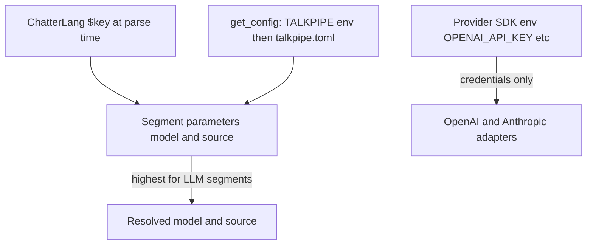

# Model and source configuration

TalkPipe LLM segments need two values for every call:

- **`source`** — which backend provides the model (for example `ollama`, `openai`, or `anthropic` for chat).
- **`model`** — the model id on that backend (for example `llama3.2`, `gpt-4o`, or `mxbai-embed-large`).

You can set these on each segment, in `~/.talkpipe.toml`, via `TALKPIPE_*` environment variables, or through ChatterLang `$key` substitution. This guide explains how those layers interact. For logging, security, and general config mechanics, see [Configuration architecture](../architecture/configuration.md).

---

## Supported sources

Sources are registered in `talkpipe.llm.config`:

| Segment | Registered sources |
|---------|-------------------|
| **`llmPrompt`** (chat) | `ollama`, `openai`, `anthropic` |
| **`llmEmbed`** (embeddings) | `ollama` |

Additional sources can be registered at runtime with `registerPromptAdapter` or `registerEmbeddingAdapter` (see [Extending TalkPipe](../architecture/extending-talkpipe.md)).

Install optional provider dependencies as needed: `pip install talkpipe[ollama]`, `talkpipe[openai]`, `talkpipe[anthropic]`, or `talkpipe[all]`.

---

## How values are resolved

When `LLMPrompt` or `LLMEmbed` is constructed, TalkPipe fills in missing `model` / `source` from `get_config()` (merged `~/.talkpipe.toml` plus `TALKPIPE_*` environment variables). If either is still missing, construction raises an error.



### Precedence (highest first)

| Layer | How it applies | Example |
|-------|----------------|---------|
| **Segment parameters** | Explicit `model` / `source` on the segment always win | `llmPrompt[model="gpt-4o", source="openai"]` |
| **ChatterLang `$key`** | Resolved at parse time from `get_config()` | `llmPrompt[model=$default_model_name, source=$default_model_source]` |
| **Environment variables** | `TALKPIPE_` + exact config key name | `export TALKPIPE_default_model_name=llama3.2` |
| **Configuration file** | `~/.talkpipe.toml` | `default_model_name = "llama3.2"` |

Within `get_config()`, environment variables override file values. ChatterLang `$key` precedence for CLI overrides is documented in [Configuration architecture](../architecture/configuration.md#chatterlang-script-variable-access): command-line `--key value` beats `TALKPIPE_key` beats TOML.

**Provider credentials** (API keys) are separate: OpenAI and Anthropic adapters use their official SDKs, which read `OPENAI_API_KEY` and `ANTHROPIC_API_KEY` from the environment—not TalkPipe `default_*` keys.

---

## Configuration keys

### Segment defaults (`default_*`)

Used by `llmPrompt` and `llmEmbed` when `model` / `source` are omitted:

| Purpose | TOML / config key | Environment variable |
|---------|-------------------|----------------------|
| Default chat model | `default_model_name` | `TALKPIPE_default_model_name` |
| Default chat source | `default_model_source` | `TALKPIPE_default_model_source` |
| Default embedding model | `default_embedding_model_name` | `TALKPIPE_default_embedding_model_name` |
| Default embedding source | `default_embedding_model_source` | `TALKPIPE_default_embedding_model_source` |
| Ollama server URL | `OLLAMA_SERVER_URL` | `TALKPIPE_OLLAMA_SERVER_URL` |

Example `~/.talkpipe.toml`:

```toml
default_model_name = "llama3.2"
default_model_source = "ollama"
default_embedding_model_name = "mxbai-embed-large"
default_embedding_model_source = "ollama"
OLLAMA_SERVER_URL = "http://localhost:11434"
```

### RAG CLI defaults (`DEFAULT_*`)

`makevectordatabase` and `serverag` read these when you omit `--embedding_model`, `--embedding_source`, `--completion_model`, and `--completion_source`:

| Purpose | TOML / config key | Environment variable |
|---------|-------------------|----------------------|
| Embedding model | `DEFAULT_EMBEDDING_MODEL` | `TALKPIPE_DEFAULT_EMBEDDING_MODEL` |
| Embedding source | `DEFAULT_EMBEDDING_SOURCE` | `TALKPIPE_DEFAULT_EMBEDDING_SOURCE` |
| Completion model | `DEFAULT_LLM_MODEL` | `TALKPIPE_DEFAULT_LLM_MODEL` |
| Completion source | `DEFAULT_LLM_SOURCE` | `TALKPIPE_DEFAULT_LLM_SOURCE` |

If a CLI flag is omitted and the matching `DEFAULT_*` key is unset, the value passed into the RAG pipeline may be `None`, and inner `llmEmbed` / `llmPrompt` segments fall back to the `default_*` keys above.

**Recommendation:** set `default_*` once for most workflows. Add `DEFAULT_*` only when you want different defaults specifically for the RAG commands. See [makevectordatabase and serverag](makevectordatabase-and-serverag.md).

---

## Segment parameters

### `llmPrompt` / `LLMPrompt`

Required (directly or via config): `model`, `source`.

```chatterlang
INPUT FROM prompt[data="Summarize this:"]
| llmPrompt[model="llama3.2", source="ollama", field="data"]
| print
```

```python
from talkpipe.llm.chat import LLMPrompt

segment = LLMPrompt(model="gpt-4o", source="openai", system_prompt="You are concise.")
```

Memory and compaction options (`memory_mode`, `context_token_trigger`, etc.) are described in [ChatterLang memory controls](../architecture/chatterlang.md#llmprompt-conversation-memory-controls).

### `llmEmbed` / `LLMEmbed`

Required (directly or via config): `model`, `source`. Optional: `field` (text field to embed), `set_as` (field to store the vector on the item).

```chatterlang
INPUT FROM echo[data="Hello world"]
| llmEmbed[model="mxbai-embed-large", source="ollama", set_as="vector"]
| print
```

### RAG and vector pipelines

Higher-level segments forward model settings to inner LLM segments:

| Segment / app | Parameters |
|---------------|------------|
| `makeVectorDatabase`, `searchVectorDatabase` | `embedding_model`, `embedding_source` |
| `ragToText`, `ragToBinaryAnswer`, etc. | `embedding_model`, `embedding_source`, `completion_model`, `completion_source` |
| `makevectordatabase`, `serverag` CLIs | `--embedding_model`, `--embedding_source`, `--completion_model`, `--completion_source` |

### Ollama server URL

Not a segment parameter by default. Set `OLLAMA_SERVER_URL` in config or `TALKPIPE_OLLAMA_SERVER_URL` in the environment when Ollama is not on localhost.

---

## Examples

### 1. Explicit model and source (per call)

```chatterlang
INPUT FROM prompt[data="Hello"]
| llmPrompt[model="llama3.2", source="ollama"]
| print
```

### 2. Global defaults in TOML

With `default_model_name` and `default_model_source` set in `~/.talkpipe.toml`:

```chatterlang
INPUT FROM prompt[data="Hello"]
| llmPrompt
| print
```

### 3. Environment-only defaults (containers / CI)

```bash
export TALKPIPE_default_model_name=llama3.2
export TALKPIPE_default_model_source=ollama
export TALKPIPE_default_embedding_model_name=mxbai-embed-large
export TALKPIPE_default_embedding_model_source=ollama
chatterlang_script --script 'INPUT FROM prompt[data="Hi"] | llmPrompt | print'
```

### 4. ChatterLang `$key` and CLI overrides

```bash
chatterlang_script --script 'INPUT FROM prompt[data="Hi"] | llmPrompt[model=$default_model_name, source=$default_model_source] | print' \
  --default_model_name llama3.2 \
  --default_model_source ollama
```

### 5. Pipe API with config fallback

```python
from talkpipe.llm.chat import LLMPrompt

# Uses default_model_name / default_model_source from config when omitted
segment = LLMPrompt(system_prompt="You are helpful.")
```

---

## Troubleshooting

| Symptom | What to check |
|---------|----------------|
| `Model name and source must be provided` | Set `model` and `source` on the segment, or add `default_model_name` and `default_model_source` (or embedding equivalents for `llmEmbed`). |
| `Unknown source` | Chat: use `ollama`, `openai`, or `anthropic`. Embeddings: only `ollama` is registered unless you added adapters. |
| Ollama connection refused | Run `ollama serve` or set `OLLAMA_SERVER_URL` / `TALKPIPE_OLLAMA_SERVER_URL`. |
| OpenAI / Anthropic auth errors | Set `OPENAI_API_KEY` or `ANTHROPIC_API_KEY`; these are not read from `TALKPIPE_*` model keys. |
| RAG CLI uses unexpected models | Check `DEFAULT_*` keys and CLI flags; then check segment `default_*` fallbacks. |

---

## Related documentation

- [Configuration architecture](../architecture/configuration.md) — full config system, precedence, and security
- [ChatterLang](../architecture/chatterlang.md) — DSL syntax and `llmPrompt` memory
- [makevectordatabase and serverag](makevectordatabase-and-serverag.md) — RAG workflow
- [Quickstart](../quickstart.md) — first pipeline examples
- [Developer handbook](../contributing/developer-handbook.md) — standard `~/.talkpipe.toml` keys
