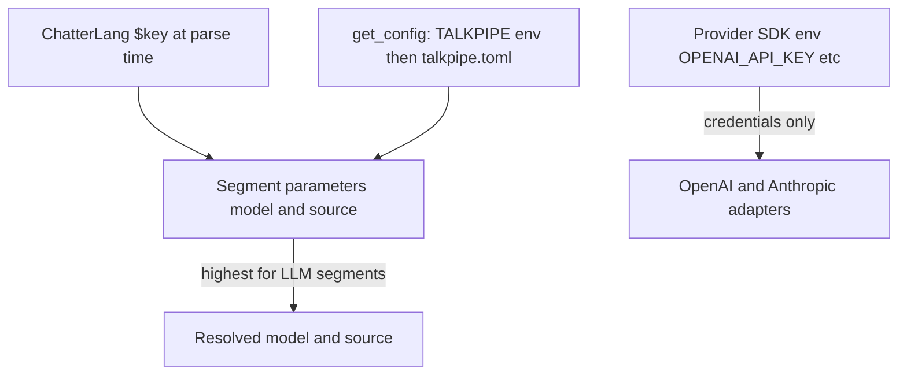

# Model and source configuration

TalkPipe LLM segments need two values for every call:

- **`source`** — which backend provides the model (for example `ollama`, `openai`, or `anthropic` for chat).
- **`model`** — the model id on that backend (for example `llama3.2`, `gpt-4o`, or `mxbai-embed-large`).

You can set these on each segment, in `~/.talkpipe.toml`, via `TALKPIPE_*` environment variables, or through ChatterLang `$key` substitution. This guide explains how those layers interact. For logging, security, and general config mechanics, see [Configuration architecture](../architecture/configuration.md).

## Contents

- [Day-to-day usage](#day-to-day-usage)
  - [Example: Ollama-first, occasional OpenAI](#example-ollama-first-occasional-openai)
  - [Why this layout](#why-this-layout)
- [Supported sources](#supported-sources)
- [How values are resolved](#how-values-are-resolved)
  - [Precedence (highest first)](#precedence-highest-first)
- [Configuration keys](#configuration-keys)
  - [Segment defaults (`default_*`)](#segment-defaults-default_)
  - [RAG CLI defaults (`DEFAULT_*`)](#rag-cli-defaults-default_)
- [Segment parameters](#segment-parameters)
  - [`llmPrompt` / `LLMPrompt`](#llmprompt--llmprompt)
  - [`llmVisionPrompt` / `LLMVisionPrompt`](#llmvisionprompt--llmvisionprompt)
  - [`llmEmbed` / `LLMEmbed`](#llmembed--llmembed)
  - [RAG and vector pipelines](#rag-and-vector-pipelines)
  - [Ollama server URL](#ollama-server-url)
- [Examples](#examples)
- [Troubleshooting](#troubleshooting)
- [Related documentation](#related-documentation)

---

## Day-to-day usage

TalkPipe gives you several ways to configure `model` and `source` — segment parameters, ChatterLang `$key` substitution, `TALKPIPE_*` environment variables, and `~/.talkpipe.toml`. The setup below is not the only valid one; it is intended to be the simplest, lowest-maintenance path for day-to-day usage. The rest of this guide details each layer so you can deviate when you need to.

The pattern assumes you have a single "main" LLM source for most calls and only reach for alternatives occasionally:

1. **Set provider credentials in your shell environment** for whichever sources you actually use. These are SDK-level keys, not TalkPipe config keys:
   - Ollama: nothing required if running on `localhost:11434`; otherwise set `TALKPIPE_OLLAMA_SERVER_URL`.
   - OpenAI: `OPENAI_API_KEY`.
   - Anthropic: `ANTHROPIC_API_KEY`.
2. **Set the `default_*` keys** for the model and source you reach for most often (chat and embeddings) — once, in `~/.talkpipe.toml` or as `TALKPIPE_*` environment variables.
3. **Write pipelines without specifying `model` / `source`** by default. Only override on the specific segments where you genuinely want a different model.

### Example: Ollama-first, occasional OpenAI

To make that concrete, here is what an Ollama-first setup looks like end-to-end. Start by writing the defaults to `~/.talkpipe.toml` once and forgetting about them:

```toml
default_model_name = "llama3.2"
default_model_source = "ollama"
default_embedding_model_name = "mxbai-embed-large"
default_embedding_model_source = "ollama"
```

Then add provider credentials to your shell for any non-Ollama backends you might use:

```bash
export OPENAI_API_KEY=sk-...
```

With those defaults in place, day-to-day ChatterLang lets a bare `llmPrompt` pick up the configured model and source — no per-call boilerplate:

```chatterlang
INPUT FROM echo[data="Quick question"]
| llmPrompt
| print
```

When a specific call needs a stronger (or just different) model, override only on that segment with `[model=..., source=...]`:

```chatterlang
INPUT FROM echo[data="Tougher question"]
| llmPrompt[model="gpt-4o", source="openai"]
| print
```

The same pattern works in the Python pipe API. Default usage relies on the config:

```python
# skip-extract
from talkpipe.pipe import io
from talkpipe.llm.chat import LLMPrompt

pipeline = io.echo(data="Summarize the latest meeting notes.") | LLMPrompt()
list(pipeline.as_function(single_out=False)())
```

And per-call overrides are the same as in ChatterLang — just constructor arguments:

```python
# skip-extract
from talkpipe.pipe import io
from talkpipe.llm.chat import LLMPrompt

careful = io.echo(data="Draft a careful legal summary.") | LLMPrompt(
    model="gpt-4o",
    source="openai",
)
list(careful.as_function(single_out=False)())
```

### Why this layout

- Provider credentials belong in the environment because the underlying SDKs read them directly and they are sensitive.
- `default_*` keys belong in `~/.talkpipe.toml` because they are stable preferences, not secrets, and you want them shared across every shell, notebook, and script.
- Per-segment overrides belong in code because the choice of model is usually tied to the specific task — and the segment parameter is the highest-precedence layer, so it always wins.

The remaining sections fill in the details behind that pattern: which `source` values are actually accepted, exactly how `model` and `source` are resolved when you omit them, every configuration key that participates, and the segment-by-segment parameter reference.

---

## Supported sources

The first piece of the pattern above is the `source` value itself. Sources are registered in `talkpipe.llm.config`:

| Segment | Registered sources |
|---------|-------------------|
| **`llmPrompt`** (chat) | `ollama`, `openai`, `anthropic` |
| **`llmVisionPrompt`** (multimodal chat) | `ollama`, `openai`, `anthropic` |
| **`llmEmbed`** (embeddings) | `ollama`, `openai`, `model2vec` |

Additional sources can be registered at runtime with `registerPromptAdapter` or `registerEmbeddingAdapter` (see [Extending TalkPipe](../architecture/extending-talkpipe.md)).

Install optional provider dependencies as needed:

| Extra | Purpose |
|-------|---------|
| `talkpipe[ollama]` | Ollama chat and embeddings |
| `talkpipe[openai]` | OpenAI chat and embeddings |
| `talkpipe[anthropic]` | Anthropic chat |
| `talkpipe[model2vec]` | In-process static embeddings via model2vec (lightweight; included in `[all]`) |
| `talkpipe[all]` | All optional features including model2vec, providers, PDF, and images |

```bash
pip install talkpipe[ollama]
pip install talkpipe[openai]
pip install talkpipe[model2vec]
pip install talkpipe[all]   # includes model2vec
```

---

## How values are resolved

The day-to-day pattern relies on TalkPipe quietly filling in `model` and `source` when you omit them. Here is the full rule it uses.

When `LLMPrompt` or `LLMEmbed` is constructed, TalkPipe fills in missing `model` / `source` from `get_config()` (merged `~/.talkpipe.toml` plus `TALKPIPE_*` environment variables). If either is still missing, construction raises an error.



### Precedence (highest first)

| Layer | How it applies | Example |
|-------|----------------|---------|
| **Segment parameters** | Explicit `model` / `source` on the segment always win | `llmPrompt[model="gpt-4o", source="openai"]` |
| **ChatterLang `$key`** | Resolved at parse time from `get_config()` | `llmPrompt[model=$default_model_name, source=$default_model_source]` |
| **Environment variables** | `TALKPIPE_` + exact config key name | `export TALKPIPE_default_model_name=llama3.2` |
| **Configuration file** | `~/.talkpipe.toml` | `default_model_name = "llama3.2"` |

Within `get_config()`, environment variables override file values. ChatterLang `$key` precedence for CLI overrides is documented in [Configuration architecture](../architecture/configuration.md#chatterlang-script-variable-access): command-line `--key value` beats `TALKPIPE_key` beats TOML.

**Provider credentials** (API keys) are separate: OpenAI and Anthropic adapters use their official SDKs, which read `OPENAI_API_KEY` and `ANTHROPIC_API_KEY` from the environment—not TalkPipe `default_*` keys.

---

## Configuration keys

The precedence table above refers to "config" generically. This section lists the specific keys TalkPipe looks for — the ones the Day-to-day section recommended setting in `~/.talkpipe.toml`, plus the separate set used by the RAG CLIs.

### Segment defaults (`default_*`)

Used by `llmPrompt`, `llmVisionPrompt`, and `llmEmbed` when `model` / `source` are omitted:

| Purpose | TOML / config key | Environment variable |
|---------|-------------------|----------------------|
| Default chat model (also used by `llmVisionPrompt`) | `default_model_name` | `TALKPIPE_default_model_name` |
| Default chat source (also used by `llmVisionPrompt`) | `default_model_source` | `TALKPIPE_default_model_source` |
| Default embedding model | `default_embedding_model_name` | `TALKPIPE_default_embedding_model_name` |
| Default embedding source | `default_embedding_model_source` | `TALKPIPE_default_embedding_model_source` |
| Ollama server URL | `OLLAMA_SERVER_URL` | `TALKPIPE_OLLAMA_SERVER_URL` |

`llmVisionPrompt` shares the chat defaults — there is no separate `default_vision_model_*` key. If your `default_model_name` is a text-only model (for example `llama3.2`), passing it to `llmVisionPrompt` will fail at the provider rather than at construction. In practice, set `model` (and usually `source`) explicitly on `llmVisionPrompt`, or set `default_model_name` to a vision-capable model and override text-only `llmPrompt` calls when you need a smaller model.

Example `~/.talkpipe.toml`:

```toml
default_model_name = "llama3.2"
default_model_source = "ollama"
default_embedding_model_name = "mxbai-embed-large"
default_embedding_model_source = "ollama"
OLLAMA_SERVER_URL = "http://localhost:11434"
```

### RAG CLI defaults (`DEFAULT_*`)

`makevectordatabase` and `serverag` read these when you omit `--embedding_model`, `--embedding_source`, `--completion_model`, and `--completion_source`:

| Purpose | TOML / config key | Environment variable |
|---------|-------------------|----------------------|
| Embedding model | `DEFAULT_EMBEDDING_MODEL` | `TALKPIPE_DEFAULT_EMBEDDING_MODEL` |
| Embedding source | `DEFAULT_EMBEDDING_SOURCE` | `TALKPIPE_DEFAULT_EMBEDDING_SOURCE` |
| Completion model | `DEFAULT_LLM_MODEL` | `TALKPIPE_DEFAULT_LLM_MODEL` |
| Completion source | `DEFAULT_LLM_SOURCE` | `TALKPIPE_DEFAULT_LLM_SOURCE` |

If a CLI flag is omitted and the matching `DEFAULT_*` key is unset, the value passed into the RAG pipeline may be `None`, and inner `llmEmbed` / `llmPrompt` segments fall back to the `default_*` keys above.

**Recommendation:** set `default_*` once for most workflows. Add `DEFAULT_*` only when you want different defaults specifically for the RAG commands. See [makevectordatabase and serverag](makevectordatabase-and-serverag.md).

---

## Segment parameters

For `llmPrompt`, `llmVisionPrompt`, and `llmEmbed`, only **`model`** and **`source`** fall back to `default_*` config keys when omitted. Every other segment parameter must be set on the segment (ChatterLang or Python); it is not read from `~/.talkpipe.toml` or `TALKPIPE_*` unless noted below for a specific higher-level segment.

### `llmPrompt` / `LLMPrompt`

Required (directly or via config): `model`, `source`.

```chatterlang
INPUT FROM prompt[data="Summarize this:"]
| llmPrompt[model="llama3.2", source="ollama", field="data"]
| print
```

```python
from talkpipe.llm.chat import LLMPrompt

segment = LLMPrompt(model="gpt-4o", source="openai", system_prompt="You are concise.")
```

Memory and compaction options (`memory_mode`, `context_token_trigger`, etc.) are described in [ChatterLang memory controls](../architecture/chatterlang.md#llmprompt-conversation-memory-controls).

### `llmVisionPrompt` / `LLMVisionPrompt`

Required (directly or via config): `model`, `source`. Required as a segment parameter: `image_field` (the item field holding the image path, URL, bytes, or `ImageResult`).

`llmVisionPrompt` resolves `model` / `source` from the same `default_model_name` / `default_model_source` keys as `llmPrompt`. There is no separate vision-specific default, so if your chat default is text-only you should override `model` (and usually `source`) on `llmVisionPrompt`:

```chatterlang
INPUT FROM loadImage[path="/path/to/diagram.png", set_as="image"]
| llmVisionPrompt[image_field="image", model="llava", source="ollama"]
| print
```

```python
# skip-extract
from talkpipe.llm.vision import LLMVisionPrompt

segment = LLMVisionPrompt(
    image_field="/path/to/image",
    model="gpt-4o",
    source="openai",
    prompt="Describe the chart.",
)
```

### `llmEmbed` / `LLMEmbed`

| Parameter | From config? | Notes |
|-----------|--------------|--------|
| `model` | Yes — `default_embedding_model_name` | Required if not passed on the segment |
| `source` | Yes — `default_embedding_model_source` | Required if not passed on the segment |
| `field` | No | Text field to embed on structured items |
| `set_as` | No | Field on the item where the vector is stored |
| `batch_size` | No | Scalar items per provider call (default `1`) |
| `fail_on_error` | No | Default `true` |

**Batching (two patterns):**

1. **Built-in buffering** — set `batch_size` greater than `1` on `llmEmbed` to amortize API round-trips without changing upstream segments.
2. **Composable buffering** — group items with `makeLists`, then embed the batch in one call:

```chatterlang
| makeLists[num_items=100, field="content"]
| llmEmbed[model="mxbai-embed-large", source="ollama", set_as="vector"]
```

Collect text on `makeLists` (`field="content"`). Do **not** set `field` on `llmEmbed` when the
stream item is a list — `field` applies to each scalar item, not to a list container or to each
dict inside a batched list. List-shaped inputs produce **one list-shaped output**: a list of
vectors, or (with `set_as` on string lists only) one list per batch. For dicts with `field` and
`set_as`, pass **scalar** dicts (one per stream item), not a list of dicts. Use `| flatten` if a
downstream segment needs one item per document. With `fail_on_error=False`, failed elements are
dropped from list outputs.

```chatterlang
INPUT FROM echo[data="Hello world"]
| llmEmbed[model="mxbai-embed-large", source="ollama", set_as="vector"]
| print
```

### RAG and vector pipelines

Higher-level segments forward model settings to inner LLM segments:

| Segment / app | Parameters |
|---------------|------------|
| `makeVectorDatabase`, `searchVectorDatabase` | `embedding_model`, `embedding_source` |
| `ragToText`, `ragToBinaryAnswer`, etc. | `embedding_model`, `embedding_source`, `completion_model`, `completion_source` |
| `makevectordatabase`, `serverag` CLIs | `--embedding_model`, `--embedding_source`, `--completion_model`, `--completion_source` |

### Ollama server URL

Not a segment parameter by default. Set `OLLAMA_SERVER_URL` in config or `TALKPIPE_OLLAMA_SERVER_URL` in the environment when Ollama is not on localhost.

---

## Examples

### 1. Explicit model and source (per call)

```chatterlang
INPUT FROM prompt[data="Hello"]
| llmPrompt[model="llama3.2", source="ollama"]
| print
```

### 2. Global defaults in TOML

With `default_model_name` and `default_model_source` set in `~/.talkpipe.toml`:

```chatterlang
INPUT FROM prompt[data="Hello"]
| llmPrompt
| print
```

### 3. Environment-only defaults (containers / CI)

```bash
export TALKPIPE_default_model_name=llama3.2
export TALKPIPE_default_model_source=ollama
export TALKPIPE_default_embedding_model_name=mxbai-embed-large
export TALKPIPE_default_embedding_model_source=ollama
chatterlang_script --script 'INPUT FROM prompt[data="Hi"] | llmPrompt | print'
```

Because `TALKPIPE_*` variables override the TOML file (see [Precedence](#precedence-highest-first)), this pattern is convenient for building a single generic TalkPipe container image that does not bake in any particular model or backend. The base image ships pipelines that omit `model` / `source`, and derived images — or runtime `docker run -e ...` / Kubernetes env — parameterize the deployment by setting `TALKPIPE_default_model_name`, `TALKPIPE_default_model_source`, and the embedding equivalents (plus `OPENAI_API_KEY` / `ANTHROPIC_API_KEY` / `TALKPIPE_OLLAMA_SERVER_URL` as needed). For example, two derived images can target different backends from the same base:

```dockerfile
FROM my-org/talkpipe-pipelines:1.0
ENV TALKPIPE_default_model_name=llama3.2 \
    TALKPIPE_default_model_source=ollama \
    TALKPIPE_default_embedding_model_name=mxbai-embed-large \
    TALKPIPE_default_embedding_model_source=ollama \
    TALKPIPE_OLLAMA_SERVER_URL=http://ollama:11434
```

```dockerfile
FROM my-org/talkpipe-pipelines:1.0
ENV TALKPIPE_default_model_name=gpt-4o \
    TALKPIPE_default_model_source=openai \
    TALKPIPE_default_embedding_model_name=text-embedding-3-small \
    TALKPIPE_default_embedding_model_source=openai
```

`OPENAI_API_KEY` is intentionally left to the runtime (a Docker secret, Kubernetes secret, or `--env` flag) rather than baked into the image.

### 4. ChatterLang `$key` and CLI overrides

```bash
chatterlang_script --script 'INPUT FROM prompt[data="Hi"] | llmPrompt[model=$default_model_name, source=$default_model_source] | print' \
  --default_model_name llama3.2 \
  --default_model_source ollama
```

### 5. Pipe API with config fallback

```python
from talkpipe.llm.chat import LLMPrompt

# Uses default_model_name / default_model_source from config when omitted
segment = LLMPrompt(system_prompt="You are helpful.")
```

---

## Troubleshooting

| Symptom | What to check |
|---------|----------------|
| `Model name and source must be provided` | Set `model` and `source` on the segment, or add `default_model_name` and `default_model_source` (or embedding equivalents for `llmEmbed`). |
| `Unknown source` | Chat / vision: use `ollama`, `openai`, or `anthropic`. Embeddings: use `ollama` or `openai` (or register additional adapters). |
| `llmVisionPrompt` errors at the provider with model-not-found / unsupported-input | `llmVisionPrompt` reads `default_model_name` / `default_model_source` (the chat defaults). Set `model` and `source` explicitly on the segment, or change the chat defaults to a vision-capable model. |
| Ollama connection refused | Run `ollama serve` or set `OLLAMA_SERVER_URL` / `TALKPIPE_OLLAMA_SERVER_URL`. |
| OpenAI / Anthropic auth errors | Set `OPENAI_API_KEY` or `ANTHROPIC_API_KEY`; these are not read from `TALKPIPE_*` model keys. |
| RAG CLI uses unexpected models | Check `DEFAULT_*` keys and CLI flags; then check segment `default_*` fallbacks. |

---

## Related documentation

- [Configuration architecture](../architecture/configuration.md) — full config system, precedence, and security
- [ChatterLang](../architecture/chatterlang.md) — DSL syntax and `llmPrompt` memory
- [makevectordatabase and serverag](makevectordatabase-and-serverag.md) — RAG workflow
- [Quickstart](../quickstart.md) — first pipeline examples
- [Developer handbook](../contributing/developer-handbook.md) — standard `~/.talkpipe.toml` keys
