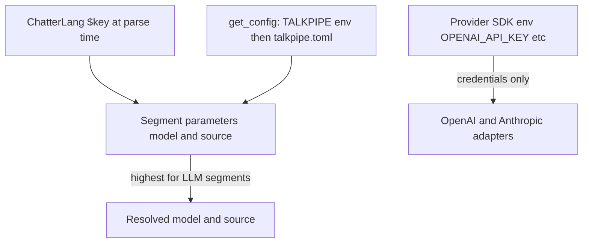

# Model and source configuration

TalkPipe is **provider-neutral**: it does not require Ollama or any other particular backend. Every LLM segment needs two values for every call:

- **`source`** — which provider serves the model: `ollama`, `openai`, or `anthropic` for chat; `ollama`, `openai`, or `model2vec` for embeddings.
- **`model`** — the model id on that provider (for example `llama3.2`, `gpt-4o`, `claude-haiku-4-5`, or `mxbai-embed-large`).

You can set these on each segment, in `~/.talkpipe.toml`, via `TALKPIPE_*` environment variables, or through ChatterLang `$key` substitution. This guide lists the providers and what each one needs, then explains how those layers interact. For logging, security, and general config mechanics, see [Configuration architecture](../architecture/configuration.md).

## Contents

- [LLM providers](#llm-providers)
  - [Choosing a provider](#choosing-a-provider)
  - [Provider notes](#provider-notes)
  - [Adding a provider](#adding-a-provider)
- [Day-to-day usage](#day-to-day-usage)
  - [Example: Ollama-first, occasional OpenAI](#example-ollama-first-occasional-openai)
  - [Why this layout](#why-this-layout)
- [How values are resolved](#how-values-are-resolved)
  - [Precedence (highest first)](#precedence-highest-first)
- [Configuration keys](#configuration-keys)
  - [Segment defaults (`default_*`)](#segment-defaults-default_)
  - [RAG CLI defaults](#rag-cli-defaults)
- [Segment parameters](#segment-parameters)
  - [`llmPrompt` / `LLMPrompt`](#llmprompt--llmprompt)
  - [`llmVisionPrompt` / `LLMVisionPrompt`](#llmvisionprompt--llmvisionprompt)
  - [`llmEmbed` / `LLMEmbed`](#llmembed--llmembed)
  - [RAG and vector pipelines](#rag-and-vector-pipelines)
  - [Ollama server URL](#ollama-server-url)
- [Examples](#examples)
- [Troubleshooting](#troubleshooting)
- [Related documentation](#related-documentation)

---

## LLM providers

These providers ship with TalkPipe (they are registered in `talkpipe.llm.config`). None of them is built in as a default, and none is required: install and configure only the ones you use.

| Provider | `source` | Chat (`llmPrompt`, `llmScore`, RAG completion, …) | Vision (`llmVisionPrompt`) | Embeddings (`llmEmbed`, vector databases) | Install | Needs |
|----------|----------|:--:|:--:|:--:|---------|-------|
| [Ollama](https://ollama.com) | `ollama` | ✓ | ✓ | ✓ | `talkpipe[ollama]` | A running Ollama server (local or remote) with the model pulled on it. No API key. |
| OpenAI | `openai` | ✓ | ✓ | ✓ | `talkpipe[openai]` | `OPENAI_API_KEY` |
| Anthropic | `anthropic` | ✓ | ✓ | — | `talkpipe[anthropic]` | `ANTHROPIC_API_KEY` |
| [model2vec](model2vec-embeddings.md) | `model2vec` | — | — | ✓ | `talkpipe[model2vec]` | Nothing: runs inside your Python process. The first use of a model downloads it from Hugging Face; later runs use the local cache. |
| Eliza | `eliza` | scripted | scripted | — | (base install) | Nothing. **Not an LLM**: a local, deterministic script for trying out pipeline syntax and multi-turn flow (it replies to the text of a turn and ignores any image). |

`pip install talkpipe[all]` installs every provider integration at once (plus PDF and image support), so you can switch or mix providers without installing anything else. Extras combine: `pip install "talkpipe[anthropic,model2vec]"`.

Because Anthropic has no embeddings API, a pipeline that uses Anthropic for chat and also needs embeddings (RAG, vector search) pairs it with `openai`, `ollama`, or `model2vec` for the embedding step.

### Choosing a provider

The provider is a parameter, not a code change:

- **Per segment:** `llmPrompt[model="gpt-4o", source="openai"]`, `llmEmbed[model="minishlab/potion-base-8M", source="model2vec"]`, or the same keyword arguments in the Pipe API (`LLMPrompt(model=..., source=...)`).
- **RAG and vector segments** take the choice twice, as `embedding_source` / `embedding_model` and `completion_source` / `completion_model`; the two are independent. The `makevectordatabase` and `serverag` commands take the same values as `--embedding_source`, `--completion_source`, and so on.
- **Defaults:** set `default_model_source` / `default_model_name` (chat and vision) and `default_embedding_model_source` / `default_embedding_model_name` (embeddings) in `~/.talkpipe.toml`, or as `TALKPIPE_default_model_source` and friends in the environment. Segments that omit `model` / `source` use them — see [Configuration keys](#configuration-keys).

If neither the segment nor the configuration supplies a source, the segment raises an error when it is constructed; TalkPipe never picks a provider for you. Each segment resolves its own provider, so different segments in one pipeline can use different providers.

For example, a setup with no Ollama at all — Anthropic for chat, in-process embeddings:

```toml
# ~/.talkpipe.toml
default_model_name = "claude-haiku-4-5"
default_model_source = "anthropic"
default_embedding_model_name = "minishlab/potion-base-8M"
default_embedding_model_source = "model2vec"
```

```bash
pip install "talkpipe[anthropic,model2vec]"
export ANTHROPIC_API_KEY=...
```

### Provider notes

- **Ollama.** Ollama is a separate application, not just the `talkpipe[ollama]` Python package: [install it](https://ollama.com/download), start it, and `ollama pull` each model you use. TalkPipe connects to `http://localhost:11434` unless you set `OLLAMA_SERVER_URL` in `~/.talkpipe.toml` or `TALKPIPE_OLLAMA_SERVER_URL` in the environment; with a remote server, pull the models **on that server**.
- **OpenAI.** The official `openai` SDK reads `OPENAI_API_KEY` from the environment; TalkPipe does not take the key from `~/.talkpipe.toml`. TalkPipe has no base-URL setting of its own, but it creates the SDK client with the SDK's defaults, so the SDK's `OPENAI_BASE_URL` environment variable points it at another endpoint. Chat segments call OpenAI's Responses API, so such an endpoint must implement `/v1/responses` for `llmPrompt`; embeddings use `/v1/embeddings`.
- **Anthropic.** The official `anthropic` SDK reads `ANTHROPIC_API_KEY` from the environment. Anthropic is chat and vision only (see above). The Anthropic API no longer accepts sampling parameters on current models, so TalkPipe does not send `temperature` to it; a configured temperature is ignored with a warning in the log.
- **model2vec.** Static embeddings computed in-process: no server, no API key, and no network once the model is cached. See [Model2vec embeddings](model2vec-embeddings.md) for model choices and precaching for offline use.
- **Eliza.** Useful when you have no provider yet, or in tests: `llmPrompt[model="Dr. Eliza", source="eliza"]` answers without any network access. It pattern-matches on the text it is given rather than understanding it, so its output says nothing about answer quality.

### Adding a provider

Other providers plug in without changes to TalkPipe. Subclass `AbstractLLMPromptAdapter` (implement `execute()` and `is_available()`, plus `execute_turn()` for `llmVisionPrompt`) or `AbstractEmbeddingAdapter` (implement `execute_one()`, and `execute_batch()` if the provider batches), then register the class under a new `source` name with `registerPromptAdapter` or `registerEmbeddingAdapter` from `talkpipe.llm.config`. Chat adapters are constructed with the segment's options as keyword arguments (`model`, `system_prompt`, `multi_turn`, `temperature`, `output_format`, …); embedding adapters with `model`. The built-in adapters in `talkpipe.llm` are the reference implementations. To make the new source available to every script, register it from a module loaded through the `talkpipe.plugins` entry point (see [Extending TalkPipe](../architecture/extending-talkpipe.md#talkpipeplugins-optional)).

---

## Day-to-day usage

TalkPipe gives you several ways to configure `model` and `source` — segment parameters, ChatterLang `$key` substitution, `TALKPIPE_*` environment variables, and `~/.talkpipe.toml`. The setup below is not the only valid one; it is meant to be the simplest, lowest-maintenance path for day-to-day usage.

The pattern assumes you have a single "main" LLM source for most calls and only reach for alternatives occasionally:

1. **Set provider credentials in your shell environment** for whichever sources you actually use. These are SDK-level keys, not TalkPipe config keys:
   - Ollama: nothing required if running on `localhost:11434`; otherwise set `TALKPIPE_OLLAMA_SERVER_URL`.
   - OpenAI: `OPENAI_API_KEY`.
   - Anthropic: `ANTHROPIC_API_KEY`.
2. **Set the `default_*` keys** for the model and source you reach for most often (chat and embeddings) — once, in `~/.talkpipe.toml` or as `TALKPIPE_*` environment variables.
3. **Write pipelines without specifying `model` / `source`** by default. Only override on the specific segments where you genuinely want a different model.

### Example: Ollama-first, occasional OpenAI

To make that concrete, here is what an Ollama-first setup looks like end-to-end. Start by writing the defaults to `~/.talkpipe.toml` once and forgetting about them:

```toml
default_model_name = "llama3.2"
default_model_source = "ollama"
default_embedding_model_name = "mxbai-embed-large"
default_embedding_model_source = "ollama"
```

Then add provider credentials to your shell for any non-Ollama backends you might use:

```bash
export OPENAI_API_KEY=sk-...
```

With those defaults in place, day-to-day ChatterLang lets a bare `llmPrompt` pick up the configured model and source — no per-call boilerplate:

```chatterlang
INPUT FROM echo[data="Quick question"]
| llmPrompt
| print
```

When a specific call needs a stronger (or just different) model, override only on that segment with `[model=..., source=...]`:

```chatterlang
INPUT FROM echo[data="Tougher question"]
| llmPrompt[model="gpt-4o", source="openai"]
| print
```

The same pattern works in the Python pipe API. Default usage relies on the config:

```python
# skip-extract
from talkpipe.pipe import io
from talkpipe.llm.chat import LLMPrompt

pipeline = io.echo(data="Summarize the latest meeting notes.") | LLMPrompt()
list(pipeline.as_function(single_out=False)())
```

And per-call overrides are the same as in ChatterLang — just constructor arguments:

```python
# skip-extract
from talkpipe.pipe import io
from talkpipe.llm.chat import LLMPrompt

careful = io.echo(data="Draft a careful legal summary.") | LLMPrompt(
    model="gpt-4o",
    source="openai",
)
list(careful.as_function(single_out=False)())
```

### Why this layout

- Provider credentials belong in the environment because the underlying SDKs read them directly and they are sensitive.
- `default_*` keys belong in `~/.talkpipe.toml` because they are stable preferences, not secrets, and you want them shared across every shell, notebook, and script.
- Per-segment overrides belong in code because the choice of model is usually tied to the specific task — and the segment parameter is the highest-precedence layer, so it always wins.

The remaining sections fill in the details behind that pattern: exactly how `model` and `source` are resolved when you omit them, every configuration key that participates, and the segment-by-segment parameter reference. The accepted `source` values are listed under [LLM providers](#llm-providers).

---

## How values are resolved

The day-to-day pattern relies on TalkPipe quietly filling in `model` and `source` when you omit them. The full rule: when `LLMPrompt` or `LLMEmbed` is constructed, TalkPipe fills in missing `model` / `source` from `get_config()` (merged `~/.talkpipe.toml` plus `TALKPIPE_*` environment variables). If either is still missing, construction raises an error.


```mermaid
flowchart TD
  segmentParams["Segment parameters model and source"]
  chatterlangDollar["ChatterLang $key at parse time"]
  getConfig["get_config: TALKPIPE env then talkpipe.toml"]
  providerSdk["Provider SDK env OPENAI_API_KEY etc"]

  segmentParams -->|"highest for LLM segments"| resolved["Resolved model and source"]
  chatterlangDollar --> segmentParams
  getConfig --> segmentParams
  providerSdk -->|"credentials only"| adapters["OpenAI and Anthropic adapters"]
```

### Precedence (highest first)

| Layer | How it applies | Example |
|-------|----------------|---------|
| **Segment parameters** | Explicit `model` / `source` on the segment always win | `llmPrompt[model="gpt-4o", source="openai"]` |
| **ChatterLang `$key`** | Resolved at parse time from `get_config()` | `llmPrompt[model=$default_model_name, source=$default_model_source]` |
| **Environment variables** | `TALKPIPE_` + exact config key name | `export TALKPIPE_default_model_name=llama3.2` |
| **Configuration file** | `~/.talkpipe.toml` | `default_model_name = "llama3.2"` |

Within `get_config()`, environment variables override file values. ChatterLang `$key` precedence for CLI overrides is documented in [Configuration architecture](../architecture/configuration.md#chatterlang-script-variable-access): command-line `--key value` beats `TALKPIPE_key` beats TOML.

**Provider credentials** (API keys) are separate: OpenAI and Anthropic adapters use their official SDKs, which read `OPENAI_API_KEY` and `ANTHROPIC_API_KEY` from the environment—not TalkPipe `default_*` keys.

---

## Configuration keys

The precedence table above refers to "config" generically. This section lists the specific keys TalkPipe looks for — the ones the Day-to-day section recommended setting in `~/.talkpipe.toml`, plus the separate set used by the RAG CLIs.

### Segment defaults (`default_*`)

Used by `llmPrompt`, `llmVisionPrompt`, and `llmEmbed` when `model` / `source` are omitted:

| Purpose | TOML / config key | Environment variable |
|---------|-------------------|----------------------|
| Default chat model (also used by `llmVisionPrompt`) | `default_model_name` | `TALKPIPE_default_model_name` |
| Default chat source (also used by `llmVisionPrompt`) | `default_model_source` | `TALKPIPE_default_model_source` |
| Default embedding model | `default_embedding_model_name` | `TALKPIPE_default_embedding_model_name` |
| Default embedding source | `default_embedding_model_source` | `TALKPIPE_default_embedding_model_source` |
| Ollama server URL | `OLLAMA_SERVER_URL` | `TALKPIPE_OLLAMA_SERVER_URL` |

`llmVisionPrompt` shares the chat defaults — there is no separate `default_vision_model_*` key. If your `default_model_name` is a text-only model (for example `llama3.2`), passing it to `llmVisionPrompt` will fail at the provider rather than at construction. In practice, set `model` (and usually `source`) explicitly on `llmVisionPrompt`, or set `default_model_name` to a vision-capable model and override text-only `llmPrompt` calls when you need a smaller model.

Example `~/.talkpipe.toml`:

```toml
default_model_name = "llama3.2"
default_model_source = "ollama"
default_embedding_model_name = "mxbai-embed-large"
default_embedding_model_source = "ollama"
OLLAMA_SERVER_URL = "http://localhost:11434"
```

### RAG CLI defaults

`makevectordatabase` and `serverag` read the same `default_*` keys above when you omit `--embedding_model`, `--embedding_source`, `--completion_model`, and `--completion_source` — there is no separate `DEFAULT_*` key for these commands. See [makevectordatabase and serverag](makevectordatabase-and-serverag.md).

---

## Segment parameters

For `llmPrompt`, `llmVisionPrompt`, and `llmEmbed`, only **`model`** and **`source`** fall back to `default_*` config keys when omitted. Every other segment parameter must be set on the segment (ChatterLang or Python); it is not read from `~/.talkpipe.toml` or `TALKPIPE_*` unless noted below for a specific higher-level segment.

### `llmPrompt` / `LLMPrompt`

Required (directly or via config): `model`, `source`.

```chatterlang
INPUT FROM prompt[data="Summarize this:"]
| llmPrompt[model="llama3.2", source="ollama", field="data"]
| print
```

<!-- doc-example: requires-openai -->
```python
from talkpipe.llm.chat import LLMPrompt

segment = LLMPrompt(model="gpt-4o", source="openai", system_prompt="You are concise.")
```

Memory and compaction options (`memory_mode`, `context_token_trigger`, etc.) are described in [ChatterLang memory controls](../architecture/chatterlang.md#llmprompt-conversation-memory-controls).

### `llmVisionPrompt` / `LLMVisionPrompt`

Required (directly or via config): `model`, `source`. Required as a segment parameter: `image_field` (the item field holding the image path, URL, bytes, or `ImageResult`).

There is no vision-specific default: `llmVisionPrompt` shares the chat defaults, so override `model` (and usually `source`) on the segment when the chat default is text-only — see [Segment defaults](#segment-defaults-default_).

```chatterlang
INPUT FROM loadImage[path="/path/to/diagram.png", set_as="image"]
| llmVisionPrompt[image_field="image", model="llava", source="ollama"]
| print
```

```python
# skip-extract
from talkpipe.llm.vision import LLMVisionPrompt

segment = LLMVisionPrompt(
    image_field="/path/to/image",
    model="gpt-4o",
    source="openai",
    prompt="Describe the chart.",
)
```

### `llmEmbed` / `LLMEmbed`

| Parameter | From config? | Notes |
|-----------|--------------|--------|
| `model` | Yes — `default_embedding_model_name` | Required if not passed on the segment |
| `source` | Yes — `default_embedding_model_source` | Required if not passed on the segment |
| `field` | No | Text field to embed on structured items |
| `set_as` | No | Field on the item where the vector is stored |
| `batch_size` | No | Scalar items per provider call (default `1`) |
| `fail_on_error` | No | Default `true`; applies to non-length failures (network, auth, etc.) |
| `on_token_overflow` | No | Default `error` — when embed fails as too long: `error`, `truncate`, or `chunk_pool` |
| `truncate_side` | No | For `truncate`: `head`, `tail` (default), or `middle` |
| `num_chunks` | No | For `chunk_pool`: segments to split into (default `2`, minimum `2`) |

**Sizing text:** Chunk or split documents **before** `llmEmbed` (e.g. `splitText`, `processDocuments`,
`makevectordatabase --chunk_size`). `on_token_overflow` is **failure recovery** when a chunk is
still too long for the model—not a substitute for upstream chunking.

**Token overflow:** TalkPipe classifies provider “too long” errors and applies `on_token_overflow`.
`truncate` retries with 20% shorter character slices per attempt; `chunk_pool` embeds `num_chunks`
contiguous parts and mean-pools to one vector per stream item. If a batch embed fails, TalkPipe
retries **per item** so you can see which chunk failed.

**Estimated pre-truncation:** set `max_estimated_tokens` on `llmEmbed` to truncate input before
calling the embedding provider. This uses a lightweight estimate, not the provider tokenizer; it
combines word count, character count, an intentionally conservative non-ASCII-heavy text estimate,
and a denser estimate for encoded-looking text such as PDF extraction artifacts.
`on_token_overflow` remains the fallback if the estimate is optimistic. `truncate_side` is shared
by both truncation paths:
estimated pre-truncation before the provider call, and
`on_token_overflow="truncate"` after the provider reports a token overflow.

**Batching:** set `batch_size` greater than `1` on `llmEmbed` to call the provider with multiple
texts per request. The stream still has **one input item and one output item per document**;
batching is internal only. `llmEmbed` does **not** accept list-shaped stream items (flatten or
emit items individually upstream). `field` and `set_as` follow
`AbstractFieldSegment` on each scalar item. With `fail_on_error=False`, non-length failures skip
items when per-item fallback runs after a batch failure.

```chatterlang
INPUT FROM echo[data="Hello world"]
| llmEmbed[model="mxbai-embed-large", source="ollama", set_as="vector"]
| print
```

```chatterlang
| llmEmbed[on_token_overflow="truncate", truncate_side="tail"]
| llmEmbed[on_token_overflow="chunk_pool", num_chunks=4]
| llmEmbed[max_estimated_tokens=8192, truncate_side="tail"]
```

### RAG and vector pipelines

Higher-level segments forward model settings to inner LLM segments:

| Segment / app | Parameters |
|---------------|------------|
| `makeVectorDatabase`, `searchVectorDatabase` | `embedding_model`, `embedding_source` |
| `ragToText`, `ragToBinaryAnswer`, etc. | `embedding_model`, `embedding_source`, `completion_model`, `completion_source` |
| `makevectordatabase`, `serverag` CLIs | `--embedding_model`, `--embedding_source`, `--completion_model`, `--completion_source` |

### Ollama server URL

Not a segment parameter by default. Set `OLLAMA_SERVER_URL` in config or `TALKPIPE_OLLAMA_SERVER_URL` in the environment when Ollama is not on localhost.

---

## Examples

### 1. Explicit model and source (per call)

```chatterlang
INPUT FROM prompt[data="Hello"]
| llmPrompt[model="llama3.2", source="ollama"]
| print
```

### 2. Local Eliza source (no provider API key)

`eliza` is a local adapter. Set `model` to the name Eliza should use when referring to itself.

```chatterlang
INPUT FROM prompt[data="I'm feeling stuck on a bug."]
| llmPrompt[model="Dr. Eliza", source="eliza", multi_turn=True]
| print
```

### 3. Global defaults in TOML

With `default_model_name` and `default_model_source` set in `~/.talkpipe.toml`:

```chatterlang
INPUT FROM prompt[data="Hello"]
| llmPrompt
| print
```

### 4. Environment-only defaults (containers / CI)

```bash
export TALKPIPE_default_model_name=llama3.2
export TALKPIPE_default_model_source=ollama
export TALKPIPE_default_embedding_model_name=mxbai-embed-large
export TALKPIPE_default_embedding_model_source=ollama
chatterlang_script --script 'INPUT FROM prompt[data="Hi"] | llmPrompt | print'
```

Because `TALKPIPE_*` variables override the TOML file (see [Precedence](#precedence-highest-first)), this pattern is convenient for building a single generic TalkPipe container image that does not bake in any particular model or backend. The base image ships pipelines that omit `model` / `source`, and derived images — or runtime `docker run -e ...` / Kubernetes env — parameterize the deployment by setting `TALKPIPE_default_model_name`, `TALKPIPE_default_model_source`, and the embedding equivalents (plus `OPENAI_API_KEY` / `ANTHROPIC_API_KEY` / `TALKPIPE_OLLAMA_SERVER_URL` as needed). For example, two derived images can target different backends from the same base:

```dockerfile
FROM my-org/talkpipe-pipelines:1.0
ENV TALKPIPE_default_model_name=llama3.2 \
    TALKPIPE_default_model_source=ollama \
    TALKPIPE_default_embedding_model_name=mxbai-embed-large \
    TALKPIPE_default_embedding_model_source=ollama \
    TALKPIPE_OLLAMA_SERVER_URL=http://ollama:11434
```

```dockerfile
FROM my-org/talkpipe-pipelines:1.0
ENV TALKPIPE_default_model_name=gpt-4o \
    TALKPIPE_default_model_source=openai \
    TALKPIPE_default_embedding_model_name=text-embedding-3-small \
    TALKPIPE_default_embedding_model_source=openai
```

`OPENAI_API_KEY` is intentionally left to the runtime (a Docker secret, Kubernetes secret, or `--env` flag) rather than baked into the image.

### 5. ChatterLang `$key` and CLI overrides

```bash
chatterlang_script --script 'INPUT FROM prompt[data="Hi"] | llmPrompt[model=$default_model_name, source=$default_model_source] | print' \
  --default_model_name llama3.2 \
  --default_model_source ollama
```

### 6. Pipe API with config fallback

<!-- doc-example: skip -->
```python
from talkpipe.llm.chat import LLMPrompt

# Uses default_model_name / default_model_source from config when omitted
segment = LLMPrompt(system_prompt="You are helpful.")
```

---

## Troubleshooting

| Symptom | What to check |
|---------|----------------|
| `Model name and source must be provided` | Set `model` and `source` on the segment, or add `default_model_name` and `default_model_source` (or embedding equivalents for `llmEmbed`). |
| `Unknown source` | Chat / vision: use `ollama`, `openai`, or `anthropic` (or `eliza` for scripted, non-LLM replies). Embeddings: use `ollama`, `openai`, or `model2vec`. Or register an adapter of your own — see [LLM providers](#llm-providers). |
| `llmVisionPrompt` errors at the provider with model-not-found / unsupported-input | `llmVisionPrompt` reads `default_model_name` / `default_model_source` (the chat defaults). Set `model` and `source` explicitly on the segment, or change the chat defaults to a vision-capable model. |
| Ollama connection refused | Run `ollama serve` or set `OLLAMA_SERVER_URL` / `TALKPIPE_OLLAMA_SERVER_URL`. |
| OpenAI / Anthropic auth errors | Set `OPENAI_API_KEY` or `ANTHROPIC_API_KEY`; these are not read from `TALKPIPE_*` model keys. |
| RAG CLI uses unexpected models | Check the `--embedding_*` / `--completion_*` flags, then the `default_embedding_model_*` / `default_model_*` config values they fall back to — there are no separate `DEFAULT_*` keys. |

---

## Related documentation

- [Configuration architecture](../architecture/configuration.md) — full config system, precedence, and security
- [ChatterLang](../architecture/chatterlang.md) — DSL syntax and `llmPrompt` memory
- [makevectordatabase and serverag](makevectordatabase-and-serverag.md) — RAG workflow
- [Quickstart](../quickstart.md) — first pipeline examples
- [Developer handbook](../contributing/developer-handbook.md) — standard `~/.talkpipe.toml` keys
